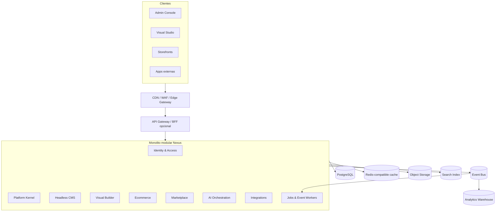
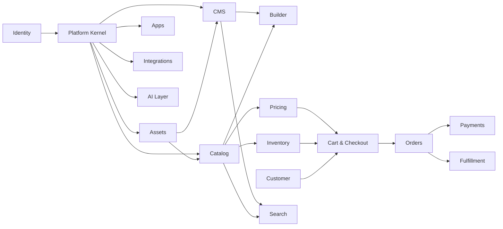
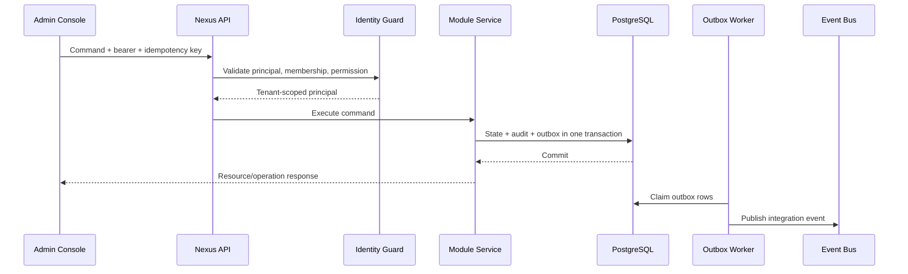
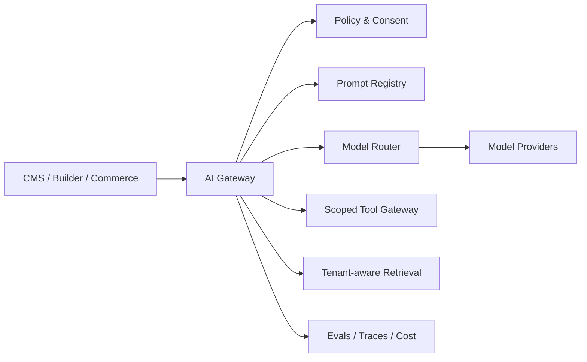

# Nexus — Arquitectura Maestra

> Estado: arquitectura objetivo; Platform Kernel implementado como Módulo 2
> Fecha: 2026-07-14
> Alcance: evolución de Nexus sobre el Módulo 1 existente, sin reescribirlo

## 1. Propósito

Nexus será una plataforma SaaS empresarial, API-first y multi-tenant para administrar empresas, múltiples tiendas por empresa, sitios web, contenido, comercio electrónico, extensiones, integraciones y capacidades de inteligencia artificial.

Este documento define la arquitectura de largo plazo y los contratos que permiten construirla incrementalmente. No representa una autorización para implementar todos los componentes de inmediato. Cada módulo debe atravesar diseño detallado, threat modeling, migraciones, pruebas de aislamiento, observabilidad y un gate de compatibilidad antes de incorporarse.

Principios rectores:

1. Conservar y endurecer el Módulo 1; no reemplazarlo.
2. Empezar como monolito modular desplegable, con límites que permitan extracción selectiva.
3. Aislamiento multi-tenant verificable en base de datos y aplicación.
4. Ningún módulo accede directamente a tablas privadas de otro módulo.
5. Los cambios de estado publican eventos mediante outbox transaccional.
6. APIs y eventos se versionan y son compatibles hacia atrás.
7. CMS, Builder y Ecommerce comparten plataforma, pero conservan modelos de dominio independientes.
8. IA es una capa gobernada; nunca una vía para eludir permisos o aislamiento.
9. Extensiones ejecutan con capacidades explícitas, cuotas y auditoría.
10. Escalar por evidencia: partición, colas y servicios dedicados se introducen cuando la carga lo exige.

## 2. Estado de partida

El repositorio contiene el Módulo 1 de identidad y multi-tenancy:

- FastAPI y SQLAlchemy async.
- PostgreSQL y Alembic.
- Usuarios, tenants, membresías, roles, permisos e invitaciones.
- JWT de acceso, refresh rotativo, sesiones, 2FA y códigos de recuperación.
- CSRF, rate limiting y auditoría.
- RLS forzado en una tabla demostrativa `tenant_resources`.
- Next.js App Router para la consola de identidad.
- Pruebas unitarias, integración PostgreSQL, frontend y Playwright.
- Docker y un workflow de GitHub Actions.

Decisiones que se conservan:

- `tenant` sigue siendo la empresa u organización contractual.
- El Módulo 1 es autoridad de usuarios, membresías, roles y sesiones.
- PostgreSQL es el sistema de registro transaccional inicial.
- Los guards revalidan membresía y permisos; las claims del JWT no son autoridad final.
- Refresh token en cookie HttpOnly y access token de vida corta.

Limitaciones de partida que deben tratarse como deuda planificada:

- RLS aún no es transversal.
- La migración inicial depende de metadata viva de SQLAlchemy.
- No existe una jerarquía formal de tiendas, sitios y canales.
- No existe outbox, bus de eventos, idempotencia general ni jobs persistentes.
- El dominio puro y el flujo SQLAlchemy directo son caminos paralelos.
- El cierre formal del Módulo 2 incorpora el baseline local; el CI remoto todavía no está demostrado.

## 3. Visión arquitectónica



### 3.1 Estrategia de despliegue

La primera etapa es un monolito modular:

- Un repositorio.
- Un artefacto backend principal.
- Un esquema PostgreSQL con ownership lógico por módulo.
- Workers separados como procesos, reutilizando paquetes de aplicación.
- Frontends desacoplados por superficie: Admin Console, Studio y Storefront runtime.

Un módulo solo se extrae a servicio cuando exista al menos uno de estos motivos:

- Perfil de escala claramente diferente.
- Requisitos de disponibilidad o seguridad distintos.
- Cadencia de despliegue independiente necesaria.
- Tecnología especializada justificada, por ejemplo búsqueda o renderizado.
- Equipos autónomos con ownership operativo real.

La extracción debe preservar API, eventos, IDs e idempotency keys; no debe requerir reescribir consumidores.

### 3.2 Control plane y data plane

Control plane:

- Identidad, empresas, membresías y permisos.
- Planes, cuotas, feature flags y billing SaaS.
- Configuración de tiendas, entornos, dominios y apps.
- Secretos, integraciones, auditoría y políticas.

Data plane:

- Contenido publicado.
- Storefront rendering y entrega de assets.
- Catálogo consultable, precios, carrito y checkout.
- Webhooks, jobs e indexación.

Separar conceptualmente ambos planos permite proteger operaciones administrativas y escalar tráfico público sin replicar toda la consola.

## 4. Jerarquía de recursos

La jerarquía canónica será:

```text
Tenant / Organization
├── Workspace (opcional para equipos o unidades de negocio)
├── Store
│   ├── Sales Channel
│   ├── Site
│   │   ├── Environment: draft | preview | production
│   │   ├── Domain
│   │   └── Locale
│   ├── Catalog assignment
│   ├── Price list assignment
│   └── Inventory scope
├── Shared assets
├── Apps and integrations
└── Billing account
```

Definiciones:

- **Tenant/Organization:** límite contractual, de membresía, facturación y aislamiento.
- **Workspace:** agrupación opcional sin convertirse en frontera de seguridad independiente.
- **Store:** unidad comercial con moneda base, mercados, políticas y canales.
- **Sales Channel:** contexto de venta, por ejemplo web, POS, marketplace o API.
- **Site:** experiencia web asociada a una tienda o sitio puramente editorial.
- **Environment:** rama de publicación con estados draft, preview y production.
- **Market:** región comercial con monedas, idioma, impuestos y disponibilidad.

Todos los recursos persistentes deben poseer:

- ID global UUID/UUIDv7 o identificador ordenable equivalente.
- `tenant_id` obligatorio, salvo tablas globales explícitas.
- `created_at`, `updated_at` y, cuando aplique, `deleted_at`.
- actor y correlation ID para operaciones sensibles.
- versión optimista para recursos editables concurrentemente.

Los IDs no confieren autorización. Todo acceso valida tenant, scope del recurso y permiso.

## 5. Boundaries de módulos

Cada módulo posee su modelo, tablas, servicios de aplicación, API y eventos. Puede consumir contratos públicos de otro módulo, nunca importar sus repositorios internos.

### 5.1 Identity & Access — existente

Responsabilidades:

- Usuarios y credenciales.
- Membresías de empresa.
- Roles, permisos e invitaciones.
- Sesiones, 2FA y auditoría de seguridad.
- Emisión y validación de principals.

No es responsable de tiendas, catálogo, clientes de tienda ni suscripciones comerciales.

### 5.2 Platform Kernel

Responsabilidades:

- Registro y ciclo de vida de recursos de plataforma.
- Stores, sites, channels, markets, locales, monedas y entornos.
- Dominios y verificación de propiedad.
- Feature flags, capacidades, planes y cuotas.
- Idempotency keys, outbox, inbox y catálogo de eventos.
- Jobs durables y estado de operaciones asíncronas.
- Convenciones transversales de tenancy y auditoría técnica.

Este módulo extiende el concepto de tenant; no duplica identidad ni membresías.

### 5.3 SaaS Billing & Entitlements

Responsabilidades:

- Plan contratado, trial, ciclo de facturación y estado de cuenta.
- Medición de uso.
- Límites duros y blandos.
- Entitlements y feature flags comerciales.
- Integración con proveedor de billing.

No administra pagos de compradores del ecommerce.

### 5.4 Asset & Media

Responsabilidades:

- Upload directo con URLs firmadas.
- Metadata, variantes, transformaciones y optimización.
- Antivirus y moderación.
- Referencias y garbage collection.
- CDN y políticas de acceso.

### 5.5 Headless CMS

Responsabilidades:

- Content types y schemas versionados.
- Entries, taxonomías y referencias.
- Draft, revisión, publicación y scheduling.
- Localización.
- Preview y delivery API.
- Historial y restauración.

El CMS almacena contenido estructurado. No almacena la composición visual completa de una página ni reglas transaccionales de comercio.

### 5.6 Visual Builder

Responsabilidades:

- Árbol de páginas y componentes.
- Registro de componentes y propiedades permitidas.
- Layout responsive, design tokens y estilos.
- Data bindings seguros hacia CMS y Commerce.
- Drafts, branches, preview, publicación y rollback.
- Colaboración, comentarios y presencia.

El Builder referencia contenido y productos por contratos; no duplica sus datos.

### 5.7 Catalog

Responsabilidades:

- Productos, variantes y opciones.
- Categorías, colecciones y taxonomía comercial.
- Atributos y media references.
- Estado editorial y publicación por canal.
- Proyecciones para búsqueda.

No calcula precio final, stock disponible ni impuestos.

### 5.8 Pricing & Promotions

Responsabilidades:

- Money types y redondeo.
- Price lists, currency y market overrides.
- Segmentación y reglas promocionales.
- Cupones y presupuestos de promoción.
- Explicación reproducible del precio calculado.

### 5.9 Inventory

Responsabilidades:

- Locations.
- Stock físico, disponible, reservado y comprometido.
- Reservas con expiración.
- Movimientos inmutables y conciliación.
- Availability projections por canal.

### 5.10 Customer & Segmentation

Responsabilidades:

- Identidad de comprador separada de usuarios administrativos.
- Perfiles, direcciones, consentimientos y preferencias.
- Segmentos y cuentas B2B.
- Exportación, borrado y privacidad.

### 5.11 Cart & Checkout

Responsabilidades:

- Carritos persistentes y anónimos.
- Snapshot de líneas y precios.
- Orquestación de shipping, tax, discounts y payment intents.
- Idempotencia y recuperación de checkout.
- Conversión controlada a orden.

### 5.12 Orders

Responsabilidades:

- Aggregate de orden y máquina de estados.
- Historial inmutable de transiciones.
- Captura de snapshots comerciales.
- Cancelación, devolución y refund orchestration.

### 5.13 Payments

Responsabilidades:

- Adaptadores de proveedores.
- Payment intents, autorizaciones, capturas y reembolsos.
- Tokens del proveedor; Nexus no almacena PAN.
- Verificación de webhooks y reconciliación.

### 5.14 Tax, Shipping & Fulfillment

Boundaries separados aunque puedan comenzar en un paquete común:

- Cálculo de impuestos y evidencia fiscal.
- Tarifas, métodos y promesas de entrega.
- Shipments, fulfillment, tracking y devoluciones.

### 5.15 Search & Discovery

Responsabilidades:

- Índices derivados de catálogo y CMS.
- Búsqueda textual, filtros, facetas y sugerencias.
- Relevancia y merchandising.
- Reindexación segura y versionada.

El índice nunca es sistema de registro.

### 5.16 Marketplace & Apps

Responsabilidades:

- Developers, apps, versiones y listings.
- Instalaciones por tenant/store.
- OAuth/API credentials y scopes.
- Billing/revenue share de apps.
- Revisión, firma, suspensión y uninstall cleanup.

### 5.17 Integrations & Automation

Responsabilidades:

- Webhooks salientes.
- Ingesta de webhooks externos.
- Conectores ERP, CRM, PIM, WMS, pagos y logística.
- Workflows trigger-condition-action.
- Reintentos, dead letters y replay.

### 5.18 Analytics

Responsabilidades:

- Eventos de producto y negocio.
- ETL/ELT hacia warehouse.
- Métricas preagregadas.
- Dashboards y exportaciones.

Las consultas analíticas pesadas no se ejecutan contra el OLTP principal.

### 5.19 AI Layer

Responsabilidades:

- Gateway de modelos y proveedores.
- Prompt registry y versionado.
- Retrieval tenant-aware.
- Herramientas con scopes explícitos.
- Evaluaciones, guardrails, costos y auditoría.
- Jobs de generación, traducción, clasificación y asistencia.

## 6. Dependencias permitidas



Reglas:

- Identity no depende de módulos de negocio.
- Kernel depende del principal de Identity, no de sus tablas.
- Commerce puede referenciar CMS/Builder solo mediante IDs o delivery contracts; checkout no depende del editor visual.
- AI consume APIs autorizadas y eventos; no accede directamente a tablas privadas.
- Search, analytics y caches son proyecciones reconstruibles.
- Integrations consume eventos públicos y comandos autorizados.
- Los ciclos se rompen mediante eventos, read models o contratos neutrales.

## 7. Contratos internos

Cada módulo expone cuatro tipos de contrato:

1. **Commands:** solicitudes de cambio, validadas e idempotentes.
2. **Queries:** lecturas sin efectos secundarios.
3. **Domain events:** hechos internos del aggregate.
4. **Integration events:** hechos estables para otros módulos y sistemas.

Una transacción solo modifica aggregates del módulo propietario. Si una operación abarca módulos:

- Se guarda el cambio local y el evento en una misma transacción.
- Workers propagan el evento.
- Consumidores aplican idempotencia en inbox.
- Se usan sagas y compensaciones, no transacciones distribuidas.

## 8. Eventos

### 8.1 Envelope estándar

Todo evento público contiene:

```json
{
  "event_id": "uuid",
  "event_type": "nexus.catalog.product.published.v1",
  "occurred_at": "RFC3339 UTC",
  "tenant_id": "uuid",
  "store_id": "uuid|null",
  "actor": {"type": "user|app|system", "id": "uuid|null"},
  "correlation_id": "uuid",
  "causation_id": "uuid|null",
  "schema_version": 1,
  "data": {}
}
```

No deben incluirse secretos, credenciales, datos de tarjeta ni PII innecesaria.

### 8.2 Eventos principales

Identity:

- `identity.user.registered.v1`
- `identity.membership.activated.v1`
- `identity.membership.deactivated.v1`
- `identity.role.assignment_changed.v1`
- `identity.session.revoked.v1`

Kernel:

- `platform.store.created.v1`
- `platform.store.activated.v1`
- `platform.site.created.v1`
- `platform.domain.verified.v1`
- `platform.entitlement.changed.v1`

CMS/Builder:

- `cms.entry.published.v1`
- `cms.entry.unpublished.v1`
- `builder.page.published.v1`
- `builder.deployment.completed.v1`

Commerce:

- `catalog.product.published.v1`
- `pricing.price_list.changed.v1`
- `inventory.reservation.created.v1`
- `checkout.completed.v1`
- `order.placed.v1`
- `payment.captured.v1`
- `fulfillment.shipped.v1`

Apps/AI:

- `app.installed.v1`
- `app.uninstalled.v1`
- `ai.job.completed.v1`
- `ai.policy.violation_detected.v1`

### 8.3 Entrega

- Garantía inicial: at-least-once.
- Orden: solo por aggregate/partition key, no global.
- Consumidores obligatoriamente idempotentes.
- Backoff exponencial, límite de reintentos y dead-letter queue.
- Replay por rango, tenant y tipo de evento.
- Schema registry y contract tests.
- Retención distinta para eventos operativos, auditoría y analytics.

## 9. Flujo de datos

### 9.1 Comando administrativo



### 9.2 Publicación CMS/Builder

1. El editor guarda draft con optimistic concurrency.
2. Validaciones de schema y referencias se ejecutan antes de publicar.
3. Se crea una versión inmutable/publication manifest.
4. Un evento activa renderizado, indexación e invalidación de CDN.
5. Preview usa un token acotado a site/environment/version.
6. Producción sirve snapshots publicados; nunca drafts.

### 9.3 Checkout y orden

1. El carrito solicita snapshots de catálogo, pricing e inventario.
2. Checkout calcula descuentos, shipping, tax y payment intent.
3. Reserva inventario con expiración.
4. Confirma pago mediante operación idempotente.
5. Crea orden con snapshots inmutables.
6. Emite `order.placed` y dispara fulfillment, notificaciones y analytics.
7. Fallos parciales ejecutan compensaciones, por ejemplo liberar reserva.

## 10. Multi-tenancy

### 10.1 Estrategia inicial

Modelo compartido de base y esquema, con `tenant_id` en cada fila de negocio y RLS forzado. Es la opción inicial más eficiente para miles de empresas y permite evolucionar a particionado o bases dedicadas.

Controles obligatorios:

- `tenant_id NOT NULL` en tablas tenant-owned.
- FKs y uniques que incluyan tenant cuando eviten referencias cruzadas.
- RLS `USING` y `WITH CHECK`.
- `SET LOCAL app.current_tenant_id` dentro de cada transacción.
- Usuario runtime sin `BYPASSRLS`.
- Pruebas de SELECT/INSERT/UPDATE/DELETE cruzados.
- Jobs y consumidores establecen contexto antes de acceder a datos.
- Object storage usa prefijos y políticas tenant-aware.
- Cache keys incluyen tenant, store, locale y versión relevante.
- Search aplica filtro tenant obligatorio en servidor.
- Logs no mezclan payloads ni secretos de tenants.

### 10.2 Estrategia de aislamiento por niveles

- Nivel estándar: tablas compartidas con RLS.
- Nivel regional: shards o clusters por región.
- Nivel enterprise: base o cluster dedicado, conservando contratos.
- Claves de cifrado dedicadas por tenant cuando el plan o regulación lo exija.

Un tenant directory del Platform Kernel resolverá `tenant_id -> shard/region/capabilities`, evitando codificar ubicación física en dominios de negocio.

### 10.3 Noisy neighbor

- Cuotas por tenant y operación.
- Rate limiting distribuido.
- Pools y worker concurrency con fairness.
- Presupuestos de consultas.
- Límites de archivos, registros, variantes, jobs y llamadas de IA.
- Circuit breakers por integración.
- Prioridades de cola por clase de servicio, no por identidad arbitraria.

## 11. Seguridad

### 11.1 Modelo zero-trust interno

- Cada request produce un principal explícito.
- Cada command declara permisos y scope de recurso.
- Ningún evento o job hereda permisos implícitos.
- Apps usan service principals diferentes de usuarios.
- Tokens de preview, upload y descarga son cortos y de alcance mínimo.

### 11.2 Autenticación y sesiones

Evolución compatible del Módulo 1:

- Validar que `session_id` siga activo para operaciones sensibles o introducir una versión de sesión/usuario.
- Separar claves JWT, TOTP y otros cifrados.
- Rotación de claves con `kid` y key ring.
- WebAuthn/passkeys y SSO SAML/OIDC para enterprise.
- Step-up authentication para ownership, dominios, claves y billing.
- Recovery y verificación de correo con tokens hasheados y auditados.

### 11.3 Autorización

RBAC continúa como base. Se agrega ABAC acotado para recursos:

- tenant, store, site, environment y market.
- ownership y estado del recurso.
- actor user/app/system.
- entitlements del plan.

Las políticas deben ser evaluables, testeables y auditables. Las claims pueden acelerar, pero no reemplazan la autoridad persistente.

### 11.4 Datos y secretos

- TLS extremo a extremo.
- Cifrado de volúmenes y object storage.
- KMS/envelope encryption para secretos.
- Secret manager; ningún secreto en repositorio o logs.
- Clasificación de PII y retención configurable.
- Exportación y borrado compatibles con obligaciones de privacidad.
- PCI scope minimizado mediante tokenización de proveedores.

### 11.5 Supply chain y SDLC

- Dependencias bloqueadas y builds reproducibles.
- SBOM, escaneo SCA, secretos e imágenes.
- Imágenes mínimas, non-root y firmadas.
- Branch protection, revisión y provenance de releases.
- Threat model por módulo.
- SAST/DAST y pruebas de autorización negativas.

## 12. Escalabilidad y resiliencia

### 12.1 Datos

- PostgreSQL con réplicas de lectura donde las garantías lo permitan.
- Índices compuestos comenzando por `tenant_id` para accesos tenant-scoped.
- Particionado temporal para auditoría, eventos y jobs.
- Particionado hash/range para aggregates de alto volumen.
- Connection pooling con límites por proceso.
- Backups continuos, PITR y simulacros de restauración.

### 12.2 Cache y CDN

- Redis-compatible para cache, locks acotados y rate limits de alta frecuencia.
- CDN para media, assets y publicaciones.
- Cache tags/version keys para invalidación determinista.
- Stale-while-revalidate en delivery no transaccional.
- Nunca usar cache como fuente de verdad de inventario, pagos u órdenes.

### 12.3 Async workloads

- Workers horizontales.
- Lease/claim transaccional para jobs.
- Idempotencia, heartbeats y timeouts.
- Colas separadas por workload: eventos, media, search, webhooks, imports, AI.
- Backpressure y límites por tenant.

### 12.4 Objetivos operativos iniciales

Los SLO definitivos dependen del producto, pero la arquitectura distinguirá:

- Admin/control plane.
- Storefront delivery.
- Checkout y pagos.
- Webhooks e integraciones.
- Publicación y jobs.

Checkout, pago y orden requieren mayor consistencia y observabilidad que edición o analytics. Cada módulo tendrá SLI de disponibilidad, latencia y corrección.

### 12.5 Disaster recovery

- RPO/RTO definidos por tier.
- Backups cifrados y restauración probada.
- Runbooks de corrupción, pérdida de región y proveedor externo caído.
- Replay de eventos y reconstrucción de índices/read models.
- Degradación controlada: storefront puede servir publicación previa; checkout no debe inventar stock o precio.

## 13. Plugin System

### 13.1 Modelo

Una app contiene:

- Manifest versionado.
- Developer y firma.
- Scopes solicitados.
- Webhooks suscritos.
- UI extensions declarativas.
- Functions o endpoints externos.
- Políticas de datos, regiones y retención.
- Plan y pricing opcional.

### 13.2 Instalación

1. Usuario autorizado revisa scopes.
2. Nexus crea `app_installation` tenant/store-scoped.
3. Se emite credencial rotatoria o flujo OAuth.
4. Se registran webhooks y extensiones permitidas.
5. Toda llamada queda atribuida al service principal de la instalación.
6. Uninstall revoca credenciales y programa cleanup/export según política.

### 13.3 Ejecución y aislamiento

Orden de preferencia:

- Apps externas por API/webhooks.
- UI extensions declarativas en sandbox.
- Functions server-side en runtime aislado con CPU, memoria, tiempo y egress limitados.

No se permiten plugins Python/Node arbitrarios dentro del proceso principal. Las extensiones no acceden a base de datos, filesystem ni secretos internos.

### 13.4 Capacidades

Scopes granulares, por ejemplo:

- `catalog.products.read`
- `catalog.products.write`
- `orders.read`
- `cms.entries.write`
- `builder.components.register`

Los scopes se intersectan con tenant, stores instaladas, entitlements y estado de la app.

## 14. AI Layer

### 14.1 Casos de uso

- Generación y traducción de contenido.
- Asistente del Builder.
- Enriquecimiento y clasificación de catálogo.
- Búsqueda semántica.
- Resumen y soporte operativo.
- Recomendaciones y segmentación con controles.
- Agentes para workflows aprobados.

### 14.2 Arquitectura



### 14.3 Reglas de seguridad

- El contexto de retrieval siempre incluye `tenant_id` y scopes de recurso.
- El modelo nunca recibe credenciales internas.
- Tool calls pasan por la misma autorización que una llamada humana.
- Acciones destructivas o financieras requieren confirmación y policy gate.
- Contenido externo se trata como no confiable frente a prompt injection.
- PII y secretos se redactan según política antes de salir a proveedores.
- El tenant controla opt-in, retención y proveedores admitidos.
- Cada generación conserva modelo, versión de prompt, costo y provenance.

### 14.4 Operación

- Jobs asíncronos para tareas largas.
- Presupuestos por tenant y usuario.
- Fallbacks de proveedor.
- Evaluaciones offline y canary antes de cambiar prompts/modelos.
- Human-in-the-loop para publicar o ejecutar acciones de alto impacto.

## 15. Headless CMS

### 15.1 Modelo

- `content_type`: schema versionado.
- `field_definition`: tipo, validación, localización y referencia.
- `entry`: identidad estable.
- `entry_version`: snapshot inmutable.
- `publication`: versión publicada por environment/locale.
- `taxonomy`: clasificación compartida.

Tipos de campo iniciales: texto, rich text estructurado, número, booleano, fecha, enum, JSON validado, media, reference y list.

### 15.2 Lifecycle

`draft -> in_review -> approved -> scheduled -> published -> archived`

Cada transición requiere permiso, valida referencias y emite evento. La publicación es inmutable; una edición crea nueva versión.

### 15.3 APIs

- Management API autenticada para schemas y contenido.
- Preview API con tokens cortos.
- Delivery API optimizada y cacheable.
- Webhooks de publicación.
- GraphQL puede añadirse como fachada de lectura cuando los casos de uso lo justifiquen; REST sigue siendo contrato de comandos.

## 16. Visual Builder

### 16.1 Documento de página

El Builder almacena un árbol JSON versionado, validado contra un component registry:

- componente y versión.
- props tipadas.
- children/slots.
- bindings declarativos.
- estilos restringidos y tokens.
- responsive variants.
- condiciones permitidas.

No se acepta JavaScript arbitrario de usuarios en el renderer principal.

### 16.2 Rendering

- Renderer determinista y versionado.
- SSR/SSG/ISR según tipo de página.
- Hydration solo para componentes interactivos.
- Assets en CDN.
- Publication manifest fija versiones de página, componentes y datos requeridos.
- Rollback cambia el manifest activo sin editar el historial.

### 16.3 Component registry

- Componentes Nexus verificados.
- Componentes del tenant.
- Componentes aportados por apps revisadas.
- Schema de props, slots, bindings y permisos.
- Versiones compatibles; una publicación no cambia por actualizar el registry.

### 16.4 Colaboración

Inicialmente optimistic concurrency y locks de edición acotados. CRDT/OT se introduce solo si colaboración simultánea real lo exige. Versiones, branches, comentarios y approvals deben existir antes de edición multiusuario compleja.

## 17. Ecommerce

### 17.1 Principios

- Money siempre usa decimal/minor units y currency explícita.
- Precio, impuestos, descuentos y disponibilidad son explicables.
- Orden conserva snapshots; no depende de que el producto siga existiendo.
- Pagos y webhooks son idempotentes.
- Inventario se modifica mediante movimientos/reservas, no sobrescrituras opacas.
- Máquinas de estado explícitas para checkout, order, payment y fulfillment.

### 17.2 Agregados principales

- Product, Variant, Collection.
- PriceList, Promotion, Coupon.
- Location, InventoryItem, Reservation.
- Customer, Address, Segment.
- Cart, Checkout.
- Order, Return.
- PaymentIntent, Transaction, Refund.
- Shipment, Fulfillment.

### 17.3 B2C y B2B

La base debe permitir posteriormente:

- Cuentas empresariales y compradores.
- Catálogos y precios contractuales.
- Quotes y purchase orders.
- Límites de crédito y aprobación.
- MOQ, packs y unidades comerciales.

No es necesario implementar B2B en la primera versión, pero los boundaries no deben fusionar usuario administrativo con customer/buyer.

## 18. Marketplace

El marketplace soportará:

- Catálogo público de apps, templates y componentes.
- Review técnico y de seguridad.
- Versionado, changelog y compatibilidad.
- Instalaciones, trials, suscripciones y revenue share.
- Ratings y soporte.
- Suspensión central y revocación de versiones vulnerables.
- Telemetría agregada respetando privacidad.

Entidades principales:

- DeveloperAccount.
- App/Template/ComponentListing.
- Release y ArtifactSignature.
- ReviewSubmission.
- Installation.
- MarketplaceSubscription.
- PayoutAccount.

El marketplace comercial no es el motor de multi-vendor ecommerce. Si Nexus incorpora sellers dentro de una tienda, será un módulo separado de marketplace commerce.

## 19. APIs

### 19.1 Superficies

- Admin API: gestión autenticada.
- Storefront API: lectura pública y sesiones de comprador.
- Checkout API: comandos transaccionales.
- Content Management API.
- Content Delivery API.
- App API: OAuth/scopes.
- Internal module contracts.
- Webhooks y event streams autorizados.

### 19.2 Convenciones

- Prefijo `/api/v1` se conserva para compatibilidad.
- OpenAPI es contrato generado y probado.
- IDs opacos.
- UTC/RFC3339.
- Paginación cursor-based para colecciones grandes.
- Filtros y orden explícitamente allowlisted.
- Errores con `code`, `message`, `details`, `request_id`.
- `Idempotency-Key` en comandos reintentables.
- ETag/version en actualizaciones concurrentes.
- Request/correlation ID propagado.
- Deprecaciones con calendario y telemetría de uso.

### 19.3 Compatibilidad

- Cambios aditivos dentro de una versión.
- Nunca cambiar semántica silenciosamente.
- Eventos conservan campos existentes; nuevos consumidores toleran campos desconocidos.
- Contract tests entre módulos, SDKs y apps.
- Versiones de componentes y schemas separadas de versiones de API.

## 20. Integraciones

### 20.1 Framework de conectores

Cada conector implementa:

- Config schema y secretos referenciados desde vault.
- OAuth/API key lifecycle.
- Capabilities declaradas.
- Mapping versionado.
- Pull/push cursors.
- Idempotencia y deduplicación.
- Rate limit y circuit breaker.
- Health status y última sincronización.

### 20.2 Webhooks

- Payload firmado con timestamp.
- Secretos rotables.
- Protección contra replay.
- Delivery log, reintentos y manual replay.
- Suscripciones filtradas por tipos y scopes.
- Desactivación automática ante fallos persistentes con notificación.

### 20.3 Import/export

- Upload a object storage.
- Validación en staging.
- Dry-run y reporte de errores por fila.
- Job durable, progreso y cancelación.
- Upsert con external IDs/idempotency keys.
- Exportaciones firmadas y con expiración.

## 21. Persistencia y migraciones

### 21.1 Ownership

Cada tabla tiene módulo propietario. Otros módulos acceden por servicio, API o read model. Se recomienda una convención de nombres o schemas PostgreSQL por módulo cuando Alembic y tooling estén preparados.

### 21.2 Migraciones

- Revisiones Alembic explícitas; no `create_all()` en historial versionado.
- Expand/contract para cambios compatibles.
- Backfills como jobs observables y reanudables.
- Índices grandes con estrategia online/concurrente.
- Downgrade solo cuando sea seguro; restauración y roll-forward para cambios irreversibles.
- Tests desde base vacía y desde snapshots de versiones soportadas.

### 21.3 Consistencia

- Transacción local por aggregate/módulo.
- Optimistic locking en edición.
- Pessimistic locking solo en invariantes críticas.
- Unique constraints como última defensa.
- Outbox en la misma transacción que el estado.
- Sagas para procesos distribuidos.

## 22. Observabilidad y operación

Obligatorio desde el siguiente módulo:

- Logs JSON con request, correlation, tenant y actor IDs; sin secretos.
- Métricas RED para HTTP y workers.
- Métricas de dominio para checkout, pagos, publicación y webhooks.
- Trazas OpenTelemetry entre API, DB, colas e integraciones.
- Error tracking con redacción de PII.
- Audit trail separado de logs operativos.
- Health/readiness checks que distingan dependencias críticas.
- Dashboards y alertas vinculados a SLO.

## 23. Testing y quality gates

Pirámide requerida:

- Unit tests de dominio.
- Integration tests con PostgreSQL real.
- Contract tests de APIs/eventos.
- RLS tests por cada tabla tenant-owned.
- Concurrency tests para invariantes.
- E2E de journeys críticos.
- Load tests para storefront, checkout y eventos.
- Security tests para authz, CSRF, SSRF, uploads y webhooks.
- Migration tests desde base vacía y versión anterior.

Gate de módulo:

1. Boundary y ownership documentados.
2. Threat model.
3. Esquema y migraciones explícitas.
4. RLS y pruebas cross-tenant.
5. APIs/eventos versionados.
6. Idempotencia y concurrencia verificadas.
7. Métricas, logs y runbook.
8. Rollout y rollback definidos.

## 24. Roadmap

El orden representa dependencias arquitectónicas, no fechas comprometidas.

### Fase 0 — Arquitectura y baseline

- Aprobar este documento.
- Mantener el baseline Git y ejecutar CI remoto antes del tag final del Módulo 2.
- Registrar ADRs para tenancy, eventos, IDs, modularidad y secretos.
- Congelar contrato actual del Módulo 1.

### Fase 1 — Platform Kernel

- Stores, sites, channels, environments, locales, currencies y markets.
- Tenant resource scopes y políticas RLS reutilizables.
- Idempotency, outbox/inbox y event envelope.
- Jobs durables, quotas, entitlements y feature flags básicos.
- Observabilidad base.
- Migraciones explícitas y estrategia expand/contract.

Estado: implementado en `app/modules/platform` y migración `0002`; consultar `docs/modules/02-platform-kernel.md` para contratos, evidencia y riesgos operacionales.

### Fase 2 — Assets + Headless CMS

- Object storage y media pipeline.
- Content types, entries, versiones, locales y workflow.
- Preview/Delivery API.
- Publicación, CDN e indexación inicial.

### Fase 3 — Builder

- Component registry.
- Page tree, design tokens y bindings.
- Preview, publication manifests y rollback.
- Templates y primeras extensiones UI seguras.

### Fase 4 — Commerce foundation

- Catalog.
- Pricing básico y markets.
- Inventory locations y availability.
- Search projections.

### Fase 5 — Transactional commerce

- Customer.
- Cart y Checkout.
- Tax y Shipping adapters.
- Orders, Payments y Fulfillment.
- Returns y refunds.

### Fase 6 — Apps e integraciones

- OAuth/scopes para apps.
- Webhooks y connector framework.
- Automation workflows.
- Marketplace privado/beta.

### Fase 7 — AI Layer

- Model gateway, budgets, prompt registry y evals.
- AI para CMS, Builder y Catalog.
- Retrieval tenant-aware y tool gateway.
- Agentes con approval gates.

La infraestructura del AI Layer puede diseñarse antes, pero no debe preceder a los contratos y datos de dominio que necesita.

### Fase 8 — Enterprise y ecosistema

- SSO/SCIM, regiones y data residency.
- Bases dedicadas y claves por tenant.
- B2B commerce.
- Marketplace público y revenue share.
- Analytics warehouse y extensibilidad avanzada.

## 25. Candidatos para el siguiente módulo

### Candidato A — Catalog

**Ventajas**

- Produce valor ecommerce visible rápidamente.
- Define productos y variantes para storefront y checkout.
- Permite empezar búsqueda e importaciones.

**Riesgos**

- Sin Store/Channel/Market, los modelos incorporarán esas nociones tarde o las improvisarán.
- Sin estándar RLS y eventos, la indexación e integraciones quedarán acopladas.
- Es probable rehacer publicación, locales, precios y asignaciones por canal.

**Dependencias**

- Stores/channels/markets.
- Assets.
- Eventos/outbox.
- Convenciones de publicación y tenancy.

**Impacto técnico**: alto valor funcional, alto riesgo de deuda si se construye ahora.

### Candidato B — Headless CMS

**Ventajas**

- Habilita contenido estructurado y APIs headless.
- Es base natural para Builder y sitios no ecommerce.
- Obliga a resolver versionado, locales y publicación.

**Riesgos**

- Sin Sites/Environments y event backbone, preview y publicación se acoplan al primer caso.
- Media y CDN todavía no tienen boundary.
- Puede mezclar contenido con composición visual prematuramente.

**Dependencias**

- Sites/environments/locales.
- Assets.
- Outbox/jobs.
- Publication contracts.

**Impacto técnico**: gran habilitador de Webflow/Builder, pero necesita plataforma previa.

### Candidato C — Asset & Media

**Ventajas**

- Reutilizable por CMS, Builder y Catalog.
- Boundary claro y relativamente independiente.
- Resuelve uploads, CDN y transformaciones temprano.

**Riesgos**

- Puede optimizarse antes de conocer patrones reales.
- No resuelve jerarquía de recursos, eventos ni consistencia entre módulos.
- Aporta poco flujo de producto por sí solo.

**Dependencias**

- Tenant/store scopes.
- Object storage y políticas de seguridad.
- Jobs durables.

**Impacto técnico**: componente transversal útil, no la fundación completa.

### Candidato D — Event & Job Backbone

**Ventajas**

- Desacopla módulos, webhooks, indexación e IA.

- Introduce idempotencia, replay y observabilidad asíncrona.
- Reduce futuras migraciones hacia servicios.

**Riesgos**

- Puede convertirse en plataforma abstracta sin consumers reales.
- No define store/site/channel ni ownership de recursos.
- Riesgo de sobreingeniería de broker demasiado pronto.

**Dependencias**

- Convenciones de tenant, IDs, eventos y transacciones.
- PostgreSQL outbox inicialmente; broker puede ser posterior.

**Impacto técnico**: muy alto, pero insuficiente como módulo aislado.

### Candidato E — Builder

**Ventajas**

- Diferenciador visible y alineado con Webflow/Builder.io.
- Valida component registry y publicación visual.

**Riesgos**

- Sin CMS, assets, sites y publication contracts terminará siendo un editor de JSON aislado.
- Alta complejidad de UX, renderizado, seguridad y compatibilidad.
- Rehacer bindings y versionado sería costoso.

**Dependencias**

- Platform Kernel.
- Assets y CMS.
- Renderer y CDN.
- Plugin/component model.

**Impacto técnico**: muy alto y prematuro.

### Candidato F — Platform Kernel

**Ventajas**

- Define la jerarquía que todos los módulos necesitan.
- Convierte multi-tenancy demostrativo en una política repetible.
- Establece events/outbox, jobs, idempotencia y observabilidad antes de multiplicar dominios.
- Habilita CMS, Builder y Commerce sin imponer sus modelos.
- Conserva Identity como autoridad y construye encima de ella.

**Riesgos**

- Puede crecer como “shared kernel” indiscriminado.
- Puede retrasar valor visible si el alcance no se mantiene mínimo.
- Entitlements, events y resource registry pueden sobrediseñarse.

**Dependencias**

- Módulo 1 estable.
- Migraciones explícitas.
- Decisiones ADR sobre tenancy, IDs y eventos.

**Impacto técnico**: máximo impacto habilitador y menor costo de corrección futura.

## 26. Recomendación

La recomendación aprobada y ejecutada para el Módulo 2 fue **Platform Kernel**.

La razón no es que sea el módulo más visible, sino que contiene las decisiones irreversibles compartidas por todas las líneas de producto: qué es una tienda, un sitio, un canal y un entorno; cómo se scopean permisos y datos; cómo se publican eventos; cómo se reintentan comandos; cómo se ejecutan jobs; y cómo se aplican cuotas y capacidades.

Construir Catalog primero obligaría a inventar stores, markets, canales y publicación dentro de Catalog. Construir CMS primero haría lo mismo con sites, environments y locales. Construir Builder primero mezclaría composición visual, contenido y runtime. Un Event Backbone aislado resolvería transporte, pero no ownership ni jerarquía.

El Platform Kernel se mantiene deliberadamente pequeño. Su primera versión incluye únicamente:

1. Store, Site, SalesChannel, Environment, Market, Locale y Currency configuration.
2. Resource scopes y helpers/políticas RLS obligatorias.
3. Event envelope, transactional outbox e idempotent inbox.
4. Idempotency keys para comandos.
5. Durable operations/jobs mínimos.
6. Entitlements y quotas básicos, sin construir todavía billing completo.
7. Correlation IDs, métricas y auditoría técnica transversal.

No debe incluir catálogo, contenido, páginas, productos, checkout, IA ni lógica de plugins. Su éxito se mide por permitir que el siguiente módulo de producto se incorpore sin crear nuevas convenciones transversales.

## 27. Decisiones adoptadas y pendientes

La aprobación del Módulo 2 fijó estas decisiones para la versión 0.2:

- Tenant permanece bajo autoridad de Identity; Store es la raíz agregada del Platform Kernel.
- UUIDv4 continúa siendo el identificador de los recursos nuevos.
- Todas las tablas tenant-aware usan RLS forzado y contexto transaccional; las tablas del módulo usan prefijo `platform_`.
- PostgreSQL outbox/inbox ofrece entrega at-least-once sin broker externo.
- Jobs durables usan PostgreSQL, leases y `SKIP LOCKED`; Operations es el contrato visible separado.
- El frontend conserva el cliente API y almacenamiento de sesión de Módulo 1.
- Entitlements son límites técnicos con overrides, no billing ni suscripciones.
- Observabilidad inicial usa correlation IDs y logs JSON, sin fijar todavía un proveedor externo.

Siguen pendientes para incrementos futuros: criterio cuantitativo de extracción a broker, supervisor de workers, tenant directory regional/sharding, object storage/CDN, backend de métricas y trazas, y ADRs propios de Assets, CMS, Builder, Catalog y Billing.
