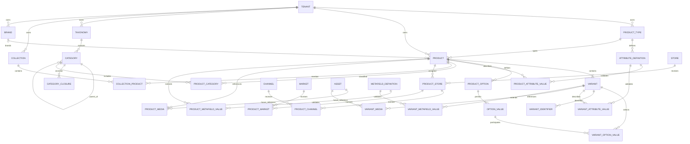

# Catalog Core — Data Model

> Documento de diseño; no constituye una migración ni autoriza implementación.
> Prefijo reservado: `catalog_`.
> Base de datos objetivo: PostgreSQL, conforme al Platform Kernel existente.

## 1. Principios del modelo

1. Todas las filas de negocio tienen `tenant_id UUID NOT NULL`.
2. Product es tenant-owned; la relación con Store se expresa solo mediante assignments.
3. Las FKs entre filas tenant-aware incluyen `tenant_id` para impedir referencias cruzadas.
4. Las tablas padre exponen `UNIQUE (tenant_id, id)` y, cuando aplica, claves compuestas más estrictas.
5. Los índices de acceso comienzan por `tenant_id`.
6. Las entidades públicas se archivan; el hard delete no forma parte de la API inicial.
7. Los estados se almacenan como strings con `CHECK`, no como enums PostgreSQL difíciles de evolucionar.
8. Datos localizados se normalizan en tablas de traducción; no se crean columnas por idioma.
9. JSONB se reserva para constraints/metafields gobernados y payloads técnicos versionados.
10. Precios, stock, binarios y documentos de búsqueda no se almacenan en Catalog.

## 2. Convenciones comunes

### 2.1 Identidad, tiempo y actores

Aggregate roots y entidades editables usan:

| Columna | Tipo | Regla |
|---|---|---|
| `id` | UUID | PRIMARY KEY, UUIDv4 generado por aplicación |
| `tenant_id` | UUID | NOT NULL, FK tenant-aware según corresponda |
| `version` | BIGINT | NOT NULL, inicia en 1, optimistic concurrency |
| `created_at` | TIMESTAMPTZ | NOT NULL, UTC, server default |
| `created_by` | UUID nullable | Actor; nullable para automatización identificada en audit metadata |
| `updated_at` | TIMESTAMPTZ | NOT NULL, UTC |
| `updated_by` | UUID nullable | Último actor |
| `archived_at` | TIMESTAMPTZ nullable | Solo entidades archivables |
| `archived_by` | UUID nullable | Solo entidades archivables |

Las asociaciones simples usan `created_at`, `created_by` y, si son reordenables o activables, `updated_at`, `updated_by`, `version`. Todas las timestamps son UTC.

Cada tabla declarada usa `id UUID PRIMARY KEY` y `UNIQUE (tenant_id, id)` salvo que su sección defina expresamente una primary key compuesta. Las tablas con PK compuesta son `catalog_category_closure`, `catalog_variant_option_values`, `catalog_product_tags`, `catalog_product_categories` y `catalog_collection_products`. Las traducciones y demás associations conservan ID técnico más unique de negocio; los assignments también usan ID técnico para versionado/auditoría.

### 2.2 Normalización

- `locale_code`: BCP 47 canónico, máximo 35 caracteres.
- `key`, `namespace`, `handle`: lowercase ASCII restringido a letras, números, `_`, `-` o `.` según el campo.
- `slug`: Unicode normalizado y política de URL definida por application layer; se persiste el valor final.
- `sku_normalized`: trim + Unicode NFKC + casefold estable; el valor de presentación permanece en `sku`.
- hashes canónicos: SHA-256 hexadecimal de 64 caracteres sobre JSON canónico versionado.

### 2.3 FKs y borrado

- Toda FK interna usa `FOREIGN KEY (tenant_id, parent_id)`.
- Una FK a Variant usa `(tenant_id, product_id, variant_id)` cuando la fila conoce Product.
- Assignments a Platform usan las claves compuestas públicas `(tenant_id, store_id)` y equivalentes store-scoped.
- No se usa `ON DELETE CASCADE` en aggregate roots archivables.
- Cascade solo es admisible para detalles privados que no poseen vida independiente, y aun así la API inicial archiva antes de purgar.
- Associations pueden usar delete físico auditado; su retiro emite evento del agregado.

### 2.4 RLS

Todas las tablas `catalog_*`, incluidas traducciones, closure y join tables, deben tener:

- `ENABLE ROW LEVEL SECURITY`;
- `FORCE ROW LEVEL SECURITY`;
- policies separadas para SELECT, INSERT, UPDATE y DELETE;
- predicado tenant con la función/configuración canónica del Kernel;
- `WITH CHECK` en INSERT/UPDATE;
- grants mínimos al runtime role sin `BYPASSRLS`.

El contexto de Store no sustituye el tenant RLS. La autorización Store/Channel/Market se aplica en application services y se respalda con FKs compuestas.

### 2.5 Auditoría

Cada comando de creación, modificación de estado, reasignación, traducción, jerarquía, identificador o asociación escribe en el audit log existente. El evento de auditoría identifica aggregate root y resume campos cambiados; no copia descripciones extensas ni archivos. La auditoría sigue siendo append-only por privilegios, no criptográficamente inmutable.

## 3. Diagrama entidad–relación

El diagrama muestra cardinalidades principales; tablas de traducción y metafields se condensan para legibilidad.

## 4. Product Type y Attributes

### 4.1 `catalog_product_types`

**Scope:** tenant. **Aggregate root:** Product Type.

Campos propios:

- `key VARCHAR(100) NOT NULL`;
- `name VARCHAR(200) NOT NULL` como nombre administrativo no localizado;
- `description TEXT NULL`;
- `status VARCHAR(20) NOT NULL CHECK IN ('active','archived')`.

Constraints e índices:

- `UNIQUE (tenant_id, id)`;
- `UNIQUE (tenant_id, key)`; se conserva tras archivo;
- índice `(tenant_id, status, name, id)` para listado cursor.

Referencias: Tenant por contrato de M1. Product referencia este agregado con `RESTRICT` lógico. No se archiva mientras existan Products activos sin una transición explícita. Auditoría/timestamps/version comunes.

### 4.2 `catalog_attribute_definitions`

**Scope:** tenant + Product Type. **Owner:** Product Type.

Campos propios:

- `product_type_id UUID NOT NULL`;
- `key VARCHAR(100) NOT NULL`;
- `data_type VARCHAR(30) NOT NULL CHECK IN ('text','long_text','integer','decimal','boolean','date','datetime','enum','reference')`;
- `value_scope VARCHAR(20) NOT NULL CHECK IN ('product','variant')`;
- `cardinality VARCHAR(10) NOT NULL CHECK IN ('one','many')`;
- `is_required`, `is_filterable`, `is_translatable`, `is_descriptive` BOOLEAN NOT NULL;
- `constraints_schema_version SMALLINT NOT NULL DEFAULT 1`;
- `constraints JSONB NOT NULL DEFAULT '{}'`;
- `position INTEGER NOT NULL CHECK (position >= 0)`;
- `status VARCHAR(20) NOT NULL CHECK IN ('active','archived')`.

Constraints e índices:

- FK `(tenant_id, product_type_id)`;
- `UNIQUE (tenant_id, id)` y `UNIQUE (tenant_id, product_type_id, id)`;
- `UNIQUE (tenant_id, product_type_id, key)`;
- índice `(tenant_id, product_type_id, status, position, id)`;
- `jsonb_typeof(constraints) = 'object'` y validación completa en dominio.

`data_type`, `value_scope` y cardinalidad no cambian si existen valores incompatibles; se crea una definición nueva o se ejecuta una migración de datos como Operation. Archive lógico. Auditoría/timestamps/version comunes.

### 4.3 `catalog_attribute_definition_translations`

**Scope:** tenant + Attribute Definition. **Owner:** Product Type.

Campos: `attribute_definition_id`, `locale_code`, `label`, `help_text`. ID técnico por convención y unique `(tenant_id, attribute_definition_id, locale_code)`. FK tenant-aware. Índice `(tenant_id, locale_code, label)`. Sin archive independiente; retiro físico auditado como cambio del Product Type. Timestamps de creación/actualización.

### 4.4 Valores tipados

Se usan dos tablas para evitar owner polimórfico sin FK:

- `catalog_product_attribute_values` con `product_id`;
- `catalog_variant_attribute_values` con `product_id`, `variant_id`.

Campos compartidos:

- `attribute_definition_id UUID NOT NULL`;
- `ordinal SMALLINT NOT NULL DEFAULT 0` para cardinalidad multiple;
- exactamente uno entre `value_text`, `value_integer`, `value_decimal`, `value_boolean`, `value_date`, `value_datetime`, `value_reference_id` o `value_enum_key`;
- `normalized_text VARCHAR(...) NULL` cuando el tipo admite igualdad/filtro;
- `unit_code VARCHAR(32) NULL` solo si la definición lo permite.

Constraints:

- FKs tenant-aware al owner y definición;
- la definición debe pertenecer al Product Type vigente del Product, validado bajo lock por dominio;
- `UNIQUE (tenant_id, owner_id, attribute_definition_id, ordinal)`;
- check de una sola columna tipada no nula;
- scope de definición compatible con la tabla;
- índices `(tenant_id, attribute_definition_id, normalized_text, owner_id)` para definiciones filterable y equivalentes por tipos numérico/boolean/fecha. Los índices parciales se crean según flags efectivos, no uno por combinación arbitraria.

Las traducciones de valores textuales viven en:

- `catalog_product_attribute_value_translations`;
- `catalog_variant_attribute_value_translations`.

Cada una usa FK tenant-aware al value, `locale_code`, `value_text`, unique `(tenant_id, attribute_value_id, locale_code)`. Los valores no traducibles no admiten filas. Retiro físico como detalle del agregado; audit/event en Product.

## 5. Product, traducciones y SEO

### 5.1 `catalog_products`

**Scope:** tenant. **Aggregate root:** Product.

Campos propios:

- `product_type_id UUID NOT NULL`;
- `brand_id UUID NULL`;
- `handle VARCHAR(160) NOT NULL` como clave administrativa estable;
- `internal_name VARCHAR(300) NOT NULL`;
- `status VARCHAR(20) NOT NULL CHECK IN ('draft','active','archived')`;
- `activated_at TIMESTAMPTZ NULL`;
- campos comunes de versión, actor, archive y timestamps.

Constraints e índices:

- `UNIQUE (tenant_id, id)`;
- `UNIQUE (tenant_id, handle)` incluso archivado;
- FK `(tenant_id, product_type_id)` y `(tenant_id, brand_id)`;
- índice de lista `(tenant_id, status, updated_at DESC, id DESC)`;
- índice `(tenant_id, product_type_id, status, id)`;
- índice `(tenant_id, brand_id, status, id)` parcial cuando brand no es null.

No contiene `store_id`, precio, stock, media URL ni estado published. Archive lógico; no hard delete API. Toda mutación incrementa `version` y genera audit/outbox según el contrato de eventos.

### 5.2 `catalog_product_translations`

**Scope:** tenant + Product + locale. **Owner:** Product.

Campos: `product_id`, `locale_code`, `title`, `short_description`, `description`, timestamps/actores. Unique `(tenant_id, product_id, locale_code)`. Índices `(tenant_id, locale_code, title, product_id)` solo para administración; no reemplazan Search. FK tenant-aware. Retiro físico auditado como edición del Product.

### 5.3 `catalog_product_seo`

**Scope:** tenant + Product + locale. **Owner:** Product.

Campos: `product_id`, `locale_code`, `slug`, `meta_title`, `meta_description`, timestamps/actores.

- `UNIQUE (tenant_id, product_id, locale_code)`;
- `UNIQUE (tenant_id, locale_code, slug)`; se conserva mientras el Product esté archivado;
- índice `(tenant_id, locale_code, slug)` sirve resolución futura, no publicación;
- FK tenant-aware.

Redirects y overrides de slug por Store no pertenecen a esta tabla.

## 6. Variant, Options e identificadores

### 6.1 `catalog_variants`

**Scope:** tenant + Product. **Owner:** Product.

Campos propios:

- `product_id UUID NOT NULL`;
- `sku VARCHAR(160) NULL` en draft;
- `sku_normalized VARCHAR(160) NULL`;
- `internal_name VARCHAR(300) NULL`;
- `status VARCHAR(20) NOT NULL CHECK IN ('draft','active','archived')`;
- `is_default BOOLEAN NOT NULL DEFAULT false`;
- `combination_schema_version SMALLINT NOT NULL DEFAULT 1`;
- `combination_key CHAR(64) NOT NULL`;
- `position INTEGER NOT NULL CHECK (position >= 0)`;
- version/actors/timestamps/archive comunes.

Constraints e índices:

- `UNIQUE (tenant_id, id)` y `UNIQUE (tenant_id, product_id, id)`;
- `UNIQUE (tenant_id, sku_normalized)` donde SKU no sea null; la fila archivada conserva la reserva;
- `UNIQUE (tenant_id, product_id, combination_key)`;
- índice unique parcial `(tenant_id, product_id) WHERE is_default`;
- índice `(tenant_id, product_id, status, position, id)`;
- check `sku` y `sku_normalized` ambos null o ambos no null;
- check `status <> 'active' OR (sku IS NOT NULL AND length(sku_normalized) > 0)`.

Una policy transaccional garantiza al menos una Variant por Product y exactamente una default para un producto simple. Variant se archiva, no se borra.

### 6.2 `catalog_variant_identifiers`

**Scope:** tenant + Variant. **Owner:** Product.

Campos:

- `product_id`, `variant_id`;
- `scheme VARCHAR(20) CHECK IN ('ean','upc','isbn','mpn','external')`;
- `namespace VARCHAR(100) NULL` obligatorio solo para `external` y opcional para `mpn`;
- `value VARCHAR(255) NOT NULL`;
- `normalized_value VARCHAR(255) NOT NULL`;
- `is_primary BOOLEAN NOT NULL DEFAULT false`;
- timestamps/actores.

Constraints e índices:

- FK `(tenant_id, product_id, variant_id)`;
- `UNIQUE (tenant_id, variant_id, scheme, namespace, normalized_value)`;
- unique `(tenant_id, scheme, normalized_value)` para EAN/UPC/ISBN cuando no haya namespace;
- unique `(tenant_id, scheme, namespace, normalized_value)` para external/MPN namespaced;
- índice `(tenant_id, variant_id, scheme, id)`;
- checks de namespace y formato.

Retiro físico auditado; los eventos identifican la Variant sin exponer secretos.

### 6.3 `catalog_product_options`

**Scope:** tenant + Product. **Owner:** Product.

Campos: `product_id`, `key`, `position`, `status active|archived`, version/actors/timestamps. Unique `(tenant_id, product_id, key)` y `(tenant_id, product_id, id)`. Índice `(tenant_id, product_id, status, position, id)`. No se archiva una Option usada por una Variant activa sin transición de combinaciones.

### 6.4 `catalog_product_option_translations`

Campos: `product_id`, `option_id`, `locale_code`, `name`. Unique `(tenant_id, option_id, locale_code)`, FK `(tenant_id, product_id, option_id)`. Retiro físico como detalle auditado.

### 6.5 `catalog_option_values`

**Scope:** tenant + Product + Option. **Owner:** Product.

Campos: `product_id`, `option_id`, `key`, `position`, `swatch_value` nullable y gobernado, `status active|archived`, version/actors/timestamps. Unique `(tenant_id, option_id, key)` y `(tenant_id, product_id, option_id, id)`. Índice `(tenant_id, option_id, status, position, id)`. No se archiva si deja una Variant activa con combinación inválida.

### 6.6 `catalog_option_value_translations`

Campos: `product_id`, `option_id`, `option_value_id`, `locale_code`, `name`. Unique `(tenant_id, option_value_id, locale_code)`. FKs compuestas. Retiro físico como detalle auditado.

### 6.7 `catalog_variant_option_values`

**Scope:** tenant + Product + Variant. **Owner:** Product.

Campos: `product_id`, `variant_id`, `option_id`, `option_value_id`, `created_at`, `created_by`.

- PK `(tenant_id, variant_id, option_id)`;
- FK a Variant y Option Value con claves tenant/product;
- `UNIQUE (tenant_id, variant_id, option_value_id)` para evitar duplicados;
- índice `(tenant_id, product_id, option_value_id, variant_id)`;
- el conjunto exacto se valida contra Options activas y origina `combination_key`.

No se modifica fila por fila desde la API: un comando reemplaza la combinación atómicamente y audita el cambio.

## 7. Brand y tags

### 7.1 `catalog_brands`

**Scope:** tenant. **Aggregate root:** Brand.

Campos: `key`, `name` administrativo, `status active|archived`, version/actors/timestamps/archive. Unique `(tenant_id, key)`. Índice `(tenant_id, status, name, id)`. No se archiva sin advertir Products activos; el Product puede conservar la referencia para historia.

### 7.2 `catalog_brand_translations`

Campos: `brand_id`, `locale_code`, `display_name`, `description`, `slug`. Unique `(tenant_id, brand_id, locale_code)` y `(tenant_id, locale_code, slug)`. FK tenant-aware. Retiro físico auditado como Brand.

### 7.3 `catalog_tags`

**Scope:** tenant. **Owner lógico:** catálogo del tenant.

Campos: `key`, `display_name`, timestamps. Unique `(tenant_id, key)`. Índice `(tenant_id, display_name, id)`. Tags sin asociaciones pueden limpiarse mediante job futuro; no son aggregate roots públicos.

### 7.4 `catalog_product_tags`

Campos: `product_id`, `tag_id`, timestamps/actor. PK `(tenant_id, product_id, tag_id)`, FKs tenant-aware, índice inverso `(tenant_id, tag_id, product_id)`. Alta/baja física auditada y evento Product.

## 8. Taxonomy y Category

### 8.1 `catalog_taxonomies`

**Scope:** tenant. **Aggregate root:** Taxonomy.

Campos: `key`, `name` administrativo, `purpose VARCHAR(30)`, `status active|archived`, `max_depth SMALLINT`, version/actors/timestamps/archive. Unique `(tenant_id, key)`. Índice `(tenant_id, status, name, id)`. Archive solo si no se usa para una publicación vigente o después de retirar assignments de productos.

### 8.2 `catalog_taxonomy_translations`

Campos: `taxonomy_id`, `locale_code`, `name`, `description`. Unique `(tenant_id, taxonomy_id, locale_code)`. FK tenant-aware. Retiro físico auditado como Taxonomy.

### 8.3 `catalog_categories`

**Scope:** tenant + Taxonomy. **Owner:** Taxonomy.

Campos:

- `taxonomy_id UUID NOT NULL`;
- `parent_id UUID NULL`;
- `key VARCHAR(120) NOT NULL`;
- `internal_name VARCHAR(250) NOT NULL`;
- `position INTEGER NOT NULL`;
- `status active|archived`;
- version/actors/timestamps/archive.

Constraints e índices:

- `UNIQUE (tenant_id, id)` y `UNIQUE (tenant_id, taxonomy_id, id)`;
- `UNIQUE (tenant_id, taxonomy_id, key)`;
- FK `(tenant_id, taxonomy_id, parent_id)` a Category de la misma Taxonomy;
- check `parent_id <> id`;
- índice `(tenant_id, taxonomy_id, parent_id, position, id)`;
- índice `(tenant_id, taxonomy_id, status, updated_at DESC, id DESC)`.

El no-ciclo se garantiza mediante closure table y comando de movimiento con lock. Archive no reparenta hijos implícitamente.

### 8.4 `catalog_category_translations`

Campos: `taxonomy_id`, `category_id`, `locale_code`, `name`, `description`, `slug`. Unique `(tenant_id, category_id, locale_code)` y `(tenant_id, taxonomy_id, locale_code, slug)`. FK tenant-aware. Retiro físico auditado.

### 8.5 `catalog_category_closure`

**Scope:** tenant + Taxonomy. **Owner:** Taxonomy.

Campos: `taxonomy_id`, `ancestor_id`, `descendant_id`, `depth SMALLINT CHECK (depth >= 0)`, timestamps.

- PK `(tenant_id, taxonomy_id, ancestor_id, descendant_id)`;
- FKs compuestas a ambas Categories;
- self row obligatoria con `depth = 0`;
- no puede existir otro path con `ancestor = descendant`;
- índice descendientes `(tenant_id, taxonomy_id, ancestor_id, depth, descendant_id)`;
- índice ancestros `(tenant_id, taxonomy_id, descendant_id, depth, ancestor_id)`.

No se edita directamente; solo el repository de jerarquía puede mantenerla. RLS obligatorio aunque sea derivada.

### 8.6 `catalog_product_categories`

Campos: `product_id`, `taxonomy_id`, `category_id`, `is_primary`, `position`, timestamps/actor.

- PK `(tenant_id, product_id, category_id)`;
- unique parcial `(tenant_id, product_id, taxonomy_id) WHERE is_primary`;
- FKs tenant-aware;
- índices `(tenant_id, category_id, product_id)` y `(tenant_id, product_id, taxonomy_id, position)`.

Alta/baja física auditada; Category y Product no se borran por cascade.

## 9. Collections

### 9.1 `catalog_collections`

**Scope:** tenant. **Aggregate root:** Collection.

Campos: `key`, `name` administrativo, `collection_type VARCHAR(20) CHECK = 'manual'` en el primer incremento, `status draft|active|archived`, version/actors/timestamps/archive. Unique `(tenant_id, key)`. Índice `(tenant_id, status, updated_at DESC, id DESC)`.

No se añade todavía `rules JSONB`. Una futura tabla versionada de reglas acompañará el soporte `automatic`.

### 9.2 `catalog_collection_translations`

Campos: `collection_id`, `locale_code`, `title`, `description`, `slug`. Unique `(tenant_id, collection_id, locale_code)` y `(tenant_id, locale_code, slug)`. FK tenant-aware. Retiro físico auditado.

### 9.3 `catalog_collection_products`

Campos: `collection_id`, `product_id`, `position`, `starts_at NULL`, `ends_at NULL`, timestamps/actor.

- PK `(tenant_id, collection_id, product_id)`;
- índice `(tenant_id, collection_id, position, product_id)`;
- índice inverso `(tenant_id, product_id, collection_id)`;
- check `ends_at IS NULL OR starts_at IS NULL OR ends_at > starts_at`;
- FKs tenant-aware.

Las fechas quedan reservadas para evaluación editorial; el primer incremento puede exigir null si no se habilita programación. Alta/baja física auditada.

## 10. Metafields

### 10.1 `catalog_metafield_definitions`

**Scope:** tenant. **Aggregate root:** Metafield Definition.

Campos: `namespace`, `key`, `name`, `target_type CHECK IN ('product','variant')`, `data_type`, `cardinality`, `is_translatable`, `validation_schema_version`, `validation JSONB`, `status active|archived`, version/actors/timestamps/archive.

- unique `(tenant_id, namespace, key)`;
- índice `(tenant_id, target_type, status, namespace, key)`;
- validation debe ser object y pasar el validador por tipo;
- tipo/target no cambia con valores existentes salvo migración Operation.

### 10.2 `catalog_metafield_definition_translations`

Campos: `metafield_definition_id`, `locale_code`, `label`, `help_text`. Unique tenant/definition/locale; FK tenant-aware; retiro físico auditado.

### 10.3 Valores de metafield

Dos tablas owner-safe:

- `catalog_product_metafield_values(product_id, definition_id, ordinal, value JSONB, value_hash)`;
- `catalog_variant_metafield_values(product_id, variant_id, definition_id, ordinal, value JSONB, value_hash)`.

Constraints: owner y definición del mismo tenant; target compatible; unique por owner/definition/ordinal; `jsonb_typeof` compatible y validación completa en dominio. Índice por definition y `value_hash` solo para igualdad gobernada; no GIN genérico por defecto.

Traducciones, solo para definiciones traducibles:

- `catalog_product_metafield_value_translations`;
- `catalog_variant_metafield_value_translations`.

Cada una referencia su value, usa locale+JSON validado y unique tenant/value/locale. Los valores son detalles reemplazables físicamente; audit/event pertenece al Product.

## 11. Media associations

### 11.1 `catalog_product_media`

Campos: `product_id`, `asset_id UUID NOT NULL`, `role CHECK IN ('primary','gallery','swatch','document')`, `position`, `focal_point JSONB NULL` gobernado, timestamps/actores.

- unique `(tenant_id, product_id, asset_id, role)`;
- unique parcial `(tenant_id, product_id) WHERE role = 'primary'`;
- índice `(tenant_id, product_id, role, position, id)`;
- sin FK de base de datos a Assets; validación por port.

### 11.2 `catalog_variant_media`

Campos equivalentes con `product_id`, `variant_id`. FK tenant-aware a Variant; uniques por Variant; índice tenant/product/variant/role/position. No se usa una tabla polimórfica con owner_type.

### 11.3 Traducciones de media

`catalog_product_media_translations` y `catalog_variant_media_translations` almacenan `locale_code` y `alt_text`, con unique tenant/media/locale y FK explícita. Retiro físico de asociación o traducción se audita como cambio Product. El Asset no se elimina.

## 12. Assignments de publicación

### 12.1 `catalog_product_stores`

**Scope:** tenant + Product + Store. **Aggregate root lógico:** Product Assignment.

Campos: `id UUID PRIMARY KEY`, `product_id`, `store_id`, `status CHECK IN ('draft','active','suspended','archived')`, `available_from`, `available_until`, version/actors/timestamps/archive.

- `UNIQUE (tenant_id, id)` y `UNIQUE (tenant_id, product_id, store_id)`;
- FKs `(tenant_id, product_id)` y `(tenant_id, store_id)`;
- índice de storefront `(tenant_id, store_id, status, product_id)`;
- índice de administración `(tenant_id, product_id, status, store_id)`;
- check de ventana temporal.

Archive conserva historial. No concede por sí solo publicación.

### 12.2 `catalog_product_channels`

Campos: `id UUID PRIMARY KEY`, `product_id`, `store_id`, `channel_id`, `status`, ventana temporal, version/actors/timestamps/archive.

- `UNIQUE (tenant_id, id)`;
- FK `(tenant_id, product_id, store_id)` al Store assignment;
- FK `(tenant_id, store_id, channel_id)` a Platform Channel;
- unique `(tenant_id, product_id, channel_id)`;
- índices `(tenant_id, store_id, channel_id, status, product_id)` y por Product;
- no puede estar active si el assignment Store no está active.

### 12.3 `catalog_product_markets`

Campos y reglas equivalentes con `id UUID PRIMARY KEY`, `market_id` y FK `(tenant_id, store_id, market_id)` a Platform Market. `UNIQUE (tenant_id, id)` y unique `(tenant_id, product_id, market_id)`. Índices target-first y product-first.

### 12.4 Lo que no se persiste

- No hay `catalog_product_sites`: Site se resuelve mediante Channel.
- No hay `catalog_product_environments`: Environment selecciona una versión/publicación posterior.
- No hay columna `published` ni `published_at` en Product.
- Publication eligibility es una query determinista y versionada, no una tabla fuente de verdad.

## 13. Índices de listados y cursores

Todos los listados públicos de alta cardinalidad usan keyset pagination. Cursores firmados/versionados contienen la última clave y filtros normalizados.

| Vista | Orden estable | Índice principal |
|---|---|---|
| Products recientes | `updated_at DESC, id DESC` | `(tenant_id, status, updated_at DESC, id DESC)` |
| Products por Store | `product_id` o snapshot sort | `(tenant_id, store_id, status, product_id)` |
| Variants de Product | `position, id` | `(tenant_id, product_id, status, position, id)` |
| Categories hermanas | `position, id` | `(tenant_id, taxonomy_id, parent_id, position, id)` |
| Collection members | `position, product_id` | `(tenant_id, collection_id, position, product_id)` |
| Products por Category | `product_id` | `(tenant_id, category_id, product_id)` |

No se usa `OFFSET` en endpoints de catálogo. Filtros no soportados por índice se rechazan o se derivan al contrato futuro de Search.

## 14. Proyección para Search

Catalog define, pero no implementa, un documento `CatalogIndexProjection` con:

- `schema_version`, `tenant_id`, `product_id`, `catalog_version`;
- traducciones y slugs autorizados;
- variantes activas e identificadores seguros;
- Product Type, Brand, categories, collections, tags;
- atributos marcados `filterable`;
- assignments efectivos por Store/Channel/Market;
- tombstone cuando se archiva o deja de ser indexable.

El documento se reconstruye desde PostgreSQL. Search aplica upsert idempotente solo si la versión entrante es mayor. El índice nunca es autoridad para comandos, permisos ni publicación.

## 15. Escalabilidad y particionamiento

### 15.1 Objetivo

El modelo debe sostener millones de Products y decenas de millones de Variants/values/assignments distribuidos entre miles de tenants, evitando que un tenant grande degrade el aislamiento lógico.

### 15.2 Medidas iniciales

- tenant-leading composite indexes;
- keyset pagination y límites máximos de página;
- batch reads para Platform y Assets;
- escrituras por aggregate, no transacciones masivas;
- bulk import mediante staging/jobs;
- `version` para invalidación de proyecciones;
- métricas por tenant y tabla sobre cardinalidad, latencia y bloat;
- índices parciales solo por patrones comprobados.

### 15.3 Particionamiento futuro

No se particiona de forma prematura. Se instrumentan tamaños y distribución. Cuando haya evidencia, candidatas:

- hash por `tenant_id` para Products, Variants, values y assignments;
- subpartición o tenant dedicado para outliers empresariales;
- partición temporal para staging/import evidence, no para master data sin necesidad.

Todas las claves e índices incluyen `tenant_id` desde el inicio para permitir esa migración. No se particiona por Store porque el Product es compartido.

## 16. Estrategia de migración futura

La migración de Catalog deberá ser explícita y determinista, siguiendo `0002_platform_kernel`, con:

1. tablas y checks;
2. índices y FKs compuestas;
3. RLS forzado y cuatro policies por tabla;
4. grants al runtime role;
5. seed de permissions/entitlements en la misma revisión controlada;
6. downgrade verificable;
7. tests base→head, head→base→head y schema contract.

Riesgo específico: `0001_identity_baseline` depende de `Base.metadata` dinámica. Mientras no se consolide, importar modelos Catalog en ese metadata podría alterar una migración histórica. La implementación debe aislar los imports de Alembic o consolidar el baseline mediante una decisión separada; nunca modificar silenciosamente el significado histórico de `0001`.

## 17. Validaciones críticas de base de datos

- dos tenants pueden usar el mismo SKU; un tenant no puede duplicarlo;
- ningún FK permite owner de otro tenant;
- no puede existir segunda Variant default de un Product;
- no puede existir segunda combinación canónica;
- no puede seleccionarse más de un valor de una misma Option;
- Category no puede apuntarse ni moverse bajo un descendiente;
- Channel/Market assignment debe compartir Store con su padre y recurso Platform;
- solo una media primary por owner;
- slugs respetan su namespace de unicidad;
- valores tipados y scopes coinciden con Attribute Definition;
- metafields coinciden con definición/version de schema;
- ausencia de tenant context devuelve cero filas y bloquea escrituras;
- conexiones reutilizadas no filtran contexto entre tenants.

## 18. Decisiones pospuestas

- Overrides de contenido/SEO por Store.
- Automatic Collections y rule AST.
- Multi-catalog B2B explícito.
- Redirect history de slugs.
- Bundles, kits y product relations.
- Tablas de publicación/snapshots por Environment.
- Motor Search y facetas materializadas.
- Particionamiento físico.
- Purge regulado y retención configurable.

Estas decisiones se posponen sin usar JSON genérico ni owner polimórfico como atajo.
