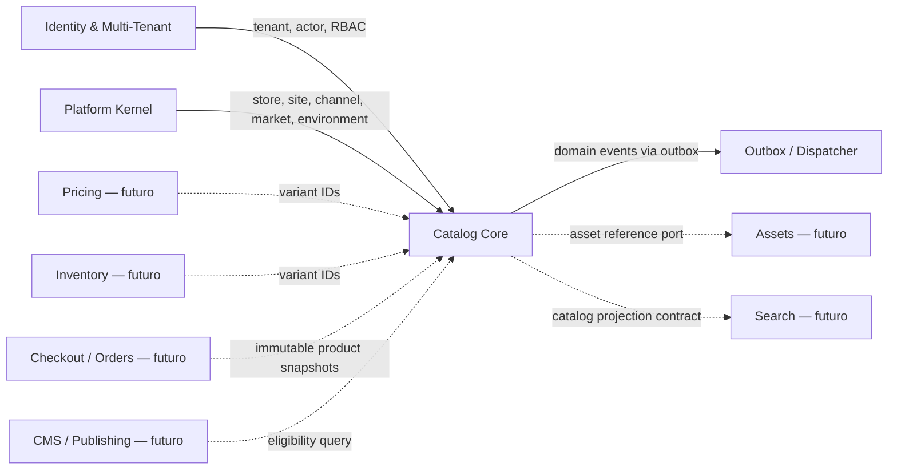
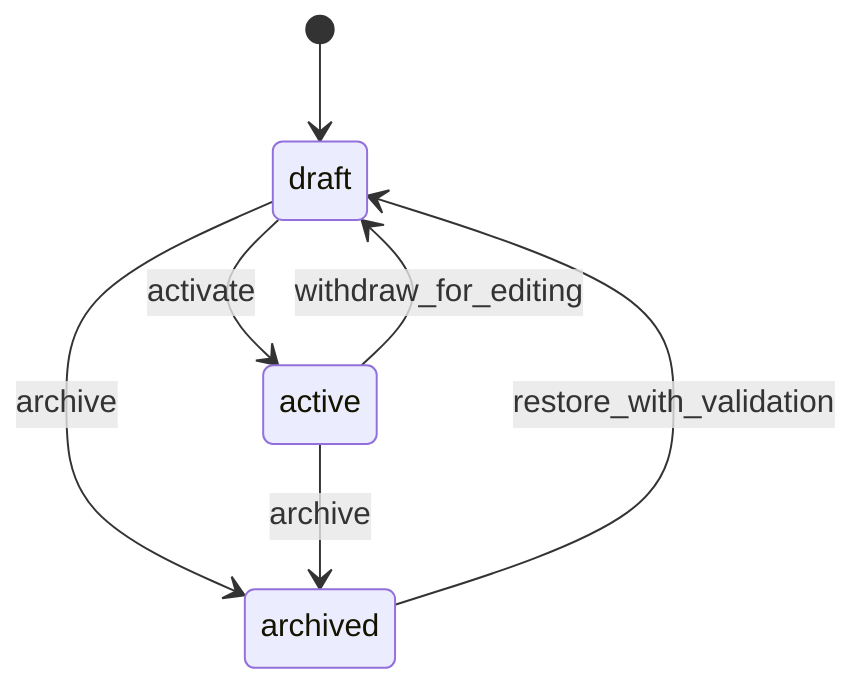

# Catalog Core — Domain Architecture

> Estado: diseño aprobado; **Módulo 3 EN PROGRESO**.
> Implementación: **M3.0 Catalog Foundation: CERRADO**; M3.1–M3.7 pendientes.
> Alcance: Módulo 3 — Catalog Core.
> Dependencias cerradas: Módulo 1 — Identity and Multi-Tenant; Módulo 2 — Platform Kernel.

## 1. Propósito

Catalog Core es la fuente de verdad para la identidad comercial, la estructura vendible, la clasificación y la disponibilidad editorial de productos dentro de un tenant. Su diseño permite que una empresa mantenga un producto maestro una sola vez y lo asigne a múltiples tiendas, canales y mercados sin duplicar el agregado.

El módulo responde estas preguntas:

- qué es un producto y cuáles son sus variantes;
- cómo se describe, traduce y clasifica;
- qué opciones forman una combinación vendible;
- qué identificadores externos posee una variante;
- en qué stores, channels y markets puede participar;
- si el producto cumple las condiciones para ser publicado por un módulo posterior.

No responde cuánto cuesta, cuánto inventario existe, cómo se cobra, dónde se almacena un archivo ni cómo se renderiza una página.

## 2. Decisiones estructurales

| Decisión | Resolución | Motivo |
|---|---|---|
| Propiedad del catálogo | El producto maestro pertenece al tenant | Una empresa puede compartir catálogo entre tiendas sin duplicación ni divergencia |
| Relación con Store | Asignaciones explícitas producto–store | Store continúa como raíz operativa del Platform Kernel, sin convertirse en propietario del producto |
| Catálogos múltiples | No se crea un agregado `Catalog` en el primer incremento | El tenant ya es el boundary; agregar otro contenedor anticipadamente añade indirection y cuotas sin un caso cerrado |
| Producto simple | Siempre tiene una variante default | Unifica SKU, identificadores y futuras relaciones con Pricing e Inventory |
| Estado editorial | `draft`, `active`, `archived` | `active` expresa aptitud editorial, no publicación |
| Publicación | Resultado calculado para un target, no estado del producto | Evita una bandera global incompatible con múltiples stores/channels/markets/environments |
| SKU | Único por tenant, normalizado y no reutilizable tras archivo | El producto se comparte entre tiendas y el SKU es identidad de integración a largo plazo |
| Jerarquías | Taxonomy + Category con closure table | Permite varias taxonomías, consultas eficientes y control explícito de ciclos |
| Collections | Membresía manual en el primer incremento | Las colecciones automáticas requieren un motor de reglas versionado que no debe improvisarse |
| Attributes y Options | Conceptos separados | Attributes describen; Options forman combinaciones vendibles |
| Metafields | Esquema controlado y separado | Extensibilidad sin convertir el núcleo en JSON/EAV no gobernado |
| Media | Catalog solo posee asociaciones y semántica | Assets será propietario de binarios, URLs, transformaciones y ciclo de vida |
| Scope registry | Los productos no se registran en `platform_resource_scopes` | Millones de productos volverían esa tabla un cuello de botella; RLS y permisos de Catalog operan por tenant y assignments |
| Consistencia | Transacciones locales, outbox e inbox del Kernel | Conserva atomicidad de agregado y entrega at-least-once entre módulos |

## 3. Boundary y contexto



### 3.1 Responsabilidad interna

Catalog Core posee:

- Product y Product Translation;
- Variant e identificadores de variante;
- Product Type y Attribute Definition;
- valores tipados de atributos de producto y variante;
- Product Option, Option Value y combinación variante–valor;
- Taxonomy, Category y jerarquía;
- Collection y membresía manual;
- Brand;
- tags normalizados;
- SEO editorial del producto;
- asociaciones de media a producto y variante;
- metafield definitions y values gobernados;
- assignments a Store, Channel y Market;
- evaluación de elegibilidad de publicación;
- eventos y proyecciones originados por cambios de catálogo.

### 3.2 Fuera del boundary

Catalog Core no posee:

- precios, listas de precios, descuentos ni moneda;
- inventario, reservas, ubicaciones ni disponibilidad física;
- archivos, transformaciones de imágenes, CDN ni storage;
- navegación del sitio, menús o composición de páginas;
- publicación/despliegue por environment;
- carrito, checkout, pagos, impuestos, fulfillment u órdenes;
- búsqueda textual, ranking o motor de facetas;
- feeds de marketplace;
- importadores concretos de terceros en el primer incremento.

## 4. Lenguaje ubicuo

| Término | Significado |
|---|---|
| Product | Agregado editorial maestro compartido por las tiendas del tenant |
| Variant | Unidad vendible e identificable; todo Product tiene al menos una |
| Default Variant | Variante única de un producto simple, sin combinación de opciones |
| Product Type | Plantilla de definiciones de atributos aplicables a productos o variantes |
| Attribute | Dato descriptivo tipado; nunca determina por sí solo una combinación vendible |
| Option | Dimensión de variación propia de un Product, por ejemplo color o talla |
| Option Value | Valor permitido dentro de una Option |
| Combination | Conjunto canónico de un valor por cada opción usado por una Variant |
| Taxonomy | Espacio jerárquico independiente de clasificación |
| Category | Nodo jerárquico dentro de una Taxonomy |
| Collection | Agrupación editorial no jerárquica de productos |
| Brand | Identidad de marca reutilizable en el tenant |
| Assignment | Autorización editorial explícita para participar en un recurso Platform |
| Publication Target | Tupla tenant/store/channel/market/environment sobre la que se evalúa elegibilidad |
| Publication Eligibility | Diagnóstico calculado; no implica que exista una publicación |
| Metafield | Extensión gobernada por definición, namespace, tipo y validación |

## 5. Agregados y ownership

| Aggregate root | Entidades/value objects internos | Invariantes que protege |
|---|---|---|
| Product | Variant, Option, Option Value, combinaciones, traducciones, SEO, tags, media associations, attribute values, metafields | Al menos una variante; una sola default; combinaciones únicas; estado coherente; versionado optimista |
| Product Type | Attribute Definition y traducciones de definición | Claves únicas; tipos y scopes inmutables cuando existen valores incompatibles |
| Taxonomy | Category, closure paths y traducciones | Sin ciclos; una raíz lógica opcional; pertenencia a una única taxonomy |
| Collection | Membresías manuales y traducciones | Producto y colección del mismo tenant; posición estable; sin duplicados |
| Brand | Traducciones | Slug y nombre gobernados dentro del tenant |
| Metafield Definition | Esquema, namespace, key y validación | Tipo y target compatibles con todos sus valores |
| Product Assignment | Store assignment y sus Channel/Market assignments | El target pertenece al mismo tenant/store y existe el assignment padre |

Las actualizaciones que cruzan agregados se coordinan en application services. No se construyen agregados gigantes para importar miles de productos en una sola transacción.

## 6. Ownership multi-tenant y multi-store

### 6.1 Regla principal

`tenant_id` es obligatorio en todas las tablas de Catalog. `catalog_products` no contiene `store_id`: el master es compartido por todas las stores del tenant.

Una empresa que necesite productos distintos puede:

- asignar productos diferentes a cada store;
- crear productos maestros separados cuando su identidad comercial sea realmente distinta;
- aplicar en módulos posteriores overrides de presentación o comercio, sin clonar la identidad base.

No se permite compartir el mismo agregado entre tenants. Un marketplace multi-vendedor deberá usar referencias y snapshots entre tenants, no filas con propiedad ambigua.

### 6.2 Assignments

La inclusión forma una jerarquía explícita:

1. Product se asigna a Store.
2. Solo bajo ese assignment puede asignarse a un Channel de la misma Store.
3. Solo bajo ese assignment puede asignarse a un Market vinculado a la misma Store.
4. Site no recibe una asignación directa: alcanza el producto a través del Channel que Platform vincula al Site.
5. Environment no recibe una asignación persistente en Catalog v1: se usa al evaluar o ejecutar publicación futura.

Esto reduce combinaciones redundantes y conserva el grafo de Platform como autoridad sobre relaciones store/site/channel/market/environment.

## 7. Product y Variant

### 7.1 Producto simple

Al crear un Product se crea dentro de la misma transacción una Variant default:

- `is_default = true`;
- sin Option Values;
- `combination_key` canónico para conjunto vacío;
- SKU obligatorio antes de pasar a `active`, aunque puede omitirse durante un borrador incompleto;
- no puede eliminarse dejando el Product sin variantes.

### 7.2 Producto configurable

Al añadir Options:

- cada Variant no default debe seleccionar exactamente un Option Value por cada Option activa;
- no puede seleccionar dos valores de la misma Option;
- dos Variants no pueden representar la misma combinación;
- la combinación se ordena por Option ID y se persiste como hash canónico para unicidad y concurrencia;
- agregar un Option no genera el producto cartesiano automáticamente;
- un comando de previsualización calcula el número de combinaciones y un comando explícito confirma cuáles crear;
- el límite `catalog.variants.max_per_product` se comprueba antes de generar o crear.

La conversión simple–configurable es una transición explícita y auditada. La Variant default puede transformarse en una combinación concreta solo si no rompe referencias externas; de lo contrario se conserva y se archiva después de crear reemplazos.

### 7.3 Identificadores

El SKU vive en Variant porque identifica la unidad vendible. Se conserva también un registro extensible de identificadores:

- `ean`;
- `upc`;
- `isbn`;
- `mpn`;
- `external`, acompañado por namespace o source system.

Normalización:

- SKU: trim, normalización Unicode y comparación case-insensitive mediante `sku_normalized`;
- EAN/UPC/ISBN: se eliminan separadores permitidos y se valida longitud/check digit cuando corresponda;
- MPN: normalización definida por tenant/source, sin perder el valor original;
- external: unicidad por `(tenant, namespace, normalized_value)`.

El SKU es único en todo el tenant, incluidas variantes archivadas. No es global y no se redefine por Store.

## 8. Lifecycle y publicación

### 8.1 Estados



`archived` es exclusión lógica. Restaurar vuelve a `draft` y revalida SKU, referencias, cuotas y Product Type.

### 8.2 Active no significa published

Un Product `active` solo está editorialmente preparado. Para un publication target se devuelve:

- `eligible: boolean`;
- `target` normalizado;
- `catalog_version`;
- `reasons[]` con códigos estables y campos afectados;
- `evaluated_at`.

Condiciones mínimas:

- Product activo y no archivado;
- al menos una Variant activa con SKU válido;
- atributos requeridos satisfechos en los scopes correctos;
- traducción para el locale requerido del target;
- Store assignment activo;
- Channel y Market assignments activos cuando fueron solicitados;
- recursos Platform activos y con relaciones válidas;
- límites y políticas del tenant vigentes.

La presencia de media no será requisito duro inicial; una política futura del tenant o channel podrá convertirla en condición. Precio e inventario no son condiciones de Catalog: los módulos de publicación/commerce combinarán sus propias evaluaciones.

## 9. Taxonomy, Category y Collection

### 9.1 Taxonomy y Category

Un tenant puede tener varias taxonomías: catálogo comercial, clasificación interna o taxonomía de un marketplace. Cada Category pertenece exactamente a una Taxonomy.

La jerarquía usa:

- `parent_id` para escritura y lectura inmediata;
- closure paths `(ancestor_id, descendant_id, depth)` para consultas de árbol;
- bloqueo transaccional de los nodos afectados al mover;
- rechazo si el nuevo padre es el propio nodo o un descendiente;
- actualización atómica del closure table;
- límite de profundidad configurable en application policy.

Categoría no equivale a menú. Orden, nesting y enlaces de navegación pertenecen a CMS/Navigation.

### 9.2 Collection

Collection agrupa Products sin jerarquía. El primer incremento admite solo membresía manual con posición y fechas opcionales de vigencia reservadas para evaluación futura.

Las colecciones automáticas quedan fuera hasta definir:

- AST de reglas versionado;
- tipos de operandos;
- costo máximo de evaluación;
- invalidación de proyecciones;
- migración de versiones de reglas.

No se almacenará SQL ni expresiones ejecutables proporcionadas por usuarios.

## 10. Attributes, Options y Metafields

### 10.1 Attribute Definition

Product Type agrupa definiciones. Cada definición declara:

- key estable y traducciones de label/help;
- tipo: `text`, `long_text`, `integer`, `decimal`, `boolean`, `date`, `datetime`, `enum` o `reference`;
- scope: `product` o `variant`;
- cardinalidad: uno o varios;
- flags `required`, `filterable`, `translatable` y `descriptive`;
- constraints gobernadas: longitud, rango, precisión, regex segura, unidades o valores enum;
- posición editorial.

Los valores se persisten en columnas tipadas, con una restricción que obliga a usar la columna compatible. El JSONB se limita a constraints versionadas y no sustituye la estructura relacional.

### 10.2 Options

Options son específicas del Product y forman variantes. No se reutilizan como attributes ni como filtros editoriales globales. Una Option y sus Values tienen traducciones; la identidad estable sigue siendo su UUID y key.

### 10.3 Metafields

Metafield Definitions pertenecen al tenant y usan `(namespace, key)` único. Definen target (`product` o `variant`), tipo, cardinalidad, validación y si son traducibles. Los valores JSONB solo se aceptan después de validarse contra la definición; referencias externas usan tipos explícitos.

Metafields no participan en combinaciones y no reemplazan Attributes. Su propósito es integración/extensión controlada.

## 11. Traducciones, SEO, slugs y tags

- Las entidades traducibles usan tablas por `(tenant_id, entity_id, locale_code)`.
- Los locales se normalizan como BCP 47 y se validan contra la política de idiomas del tenant/store.
- Product Translation contiene title, short description y description.
- Product SEO contiene meta title, meta description y slug por locale.
- El slug de producto es único por tenant+locale porque el master es compartido. Overrides por store quedan fuera del primer incremento.
- Category y Brand tienen slug localizado en su propio namespace de unicidad.
- Tags son filas normalizadas por tenant; Product Tags es una asociación, no un array sin gobernanza.
- Cambiar un slug emitirá evento. Los redirects pertenecen al módulo de routing/publicación futuro.

## 12. Media contract

Catalog registra únicamente:

- `asset_id` opaco;
- owner Product o Variant mediante tablas separadas;
- role (`primary`, `gallery`, `swatch`, `document`);
- posición;
- alt text localizado o referencia a traducción;
- metadatos editoriales mínimos de recorte/foco cuando el contrato de Assets lo permita.

No existe FK directa a una tabla privada de Assets. Un `AssetReferencePort` validará pertenencia al mismo tenant, estado y tipo cuando el módulo exista. Hasta entonces, la implementación de asociaciones queda condicionada a un adaptador explícito; no se aceptan URLs arbitrarias como sustituto.

Eliminar/archivar un Product elimina la asociación lógica, no el Asset. Assets decide retención y garbage collection.

## 13. Consistencia, concurrencia y auditoría

- Cada aggregate root mantiene `version` para optimistic concurrency.
- Los comandos mutantes aceptan versión esperada y responden conflicto si cambió.
- Las restricciones únicas son la autoridad final ante carreras de SKU, slug y combinación.
- El evento se inserta en `platform_outbox_events` en la misma transacción que el cambio.
- Reintentos HTTP usan el contrato existente de idempotencia del Kernel.
- Todo comando registra audit action, result, actor, tenant, aggregate, correlation y cambios seguros.
- No se incluyen descripciones completas, tokens ni payloads de importación sensibles en logs/audit metadata.
- Los consumers usan `platform_inbox_events`; cualquier efecto externo es at-least-once e idempotente.

## 14. Eliminación y retención

En el primer incremento no habrá hard delete público de aggregate roots. Se usa archive para Products, Variants, Product Types, Taxonomies, Categories, Collections, Brands y Metafield Definitions.

Las asociaciones pueden retirarse físicamente dentro de una transacción auditada y con evento, siempre que no sean evidencia histórica. El historial de eventos/auditoría no se elimina con el agregado. Una política de purge posterior podrá borrar drafts nunca publicados cuando no existan referencias ni retención legal, mediante operation/job supervisado.

## 15. Ports y dependencias permitidas

| Port | Dirección | Contrato |
|---|---|---|
| Tenant/Actor Context | Identity → Catalog | tenant autenticado, user, membership y permissions persistidos |
| Platform Resource Reader | Platform → Catalog | lectura batch de Store/Channel/Market/Environment y validación de relaciones |
| Entitlement Reader | Platform → Catalog | límites efectivos y consumo |
| Idempotency Repository | Platform → Catalog | reserva, replay y conflicto por fingerprint |
| Outbox Repository | Catalog → Platform | append transaccional del envelope estándar |
| Audit Writer | Catalog → Identity/Kernel | evidencia append-only con correlation |
| Operation/Job Scheduler | Catalog → Platform | importaciones, exports y tareas largas futuras |
| Asset Reference Port | Catalog → Assets futuro | existencia, tenant, type y estado; sin FK privada |
| Catalog Projection Port | Catalog → Search futuro | upsert/delete idempotente de documentos versionados |

Catalog no importa modelos ORM privados de otros módulos. Los IDs cruzan por contratos/application ports y solo las tablas Platform públicas admitidas reciben FKs compuestas explícitas.

## 16. Paquetes previstos

La implementación futura seguirá el monolito modular existente:

```text
app/modules/catalog/
  api/
  application/
  contracts/
  domain/
  infrastructure/
```

- `domain`: agregados, value objects, policies e invariantes sin FastAPI/SQLAlchemy;
- `application`: comandos, queries, UoW, ports, autorización e idempotencia;
- `contracts`: DTOs, eventos, projection/import contracts;
- `infrastructure`: modelos y repositorios SQLAlchemy, adapters Platform/Assets, outbox;
- `api`: rutas `/api/v1/catalog`, validación de transporte y composición de dependencias.

## 17. Evolución permitida sin romper el boundary

El diseño deja extensiones explícitas para:

- pricing e inventory referenciando Variant ID;
- Assets validando `asset_id`;
- búsqueda consumiendo proyecciones;
- CMS/Publishing consumiendo elegibilidad y snapshots;
- catálogos B2B o customer-group visibility como proyecciones/asignaciones, no cambio de ownership;
- feeds Marketplace derivados del master y mappings externos;
- bundles/kits como un módulo de composición, no como Option;
- redirects de slug y store-specific presentation en Publishing/CMS;
- automatic collections mediante un rule engine versionado.

## 18. Criterios de aceptación arquitectónicos

Las siguientes decisiones fueron aprobadas como guardrails del módulo:

1. Product maestro tenant-owned y compartido entre stores.
2. Todo Product tiene Variant, incluida la default.
3. SKU único tenant-wide y no reutilizable tras archive.
4. Assignments Store → Channel/Market; sin assignment directo a Site/Environment.
5. `active` separado de publicación.
6. Taxonomy con closure table y Collections manuales inicialmente.
7. Attributes, Options y Metafields separados.
8. Media por referencia a Assets, sin blobs ni URLs arbitrarias.
9. Productos fuera de `platform_resource_scopes`.
10. Integraciones asíncronas mediante outbox/inbox y contracts versionados.

## 19. Materialización en M3.0

M3.0 implementa un subconjunto deliberado del modelo objetivo. El boundary real reside en `app/modules/catalog` y conserva la dirección API → Application → Domain → ports/repositorios → adapters SQLAlchemy.

Implementado:

- Product Type, Brand, Product y Product Variant;
- Variant default obligatoria y creación atómica con Product;
- Product Identifier, traducción y SEO básicos;
- Taxonomy, Category y closure transaccional;
- asignaciones Product–Category y Product–Store;
- permisos, RLS, idempotencia, versiones, entitlements, audit y outbox.

Aún no materializado:

- Options/Values, Attributes, Metafields, Collections y Tags;
- Channel/Market assignments y eligibility completa por target;
- media/Assets, Search projections e import runtime;
- Pricing, Inventory y publicación.

El master continúa tenant-owned y fuera de `platform_resource_scopes`. Product–Store expresa disponibilidad administrativa y `eligible`; Publishing será el único propietario futuro del estado publicado. La descripción operativa y evidencia están en `docs/modules/03-catalog-foundation.md`.
