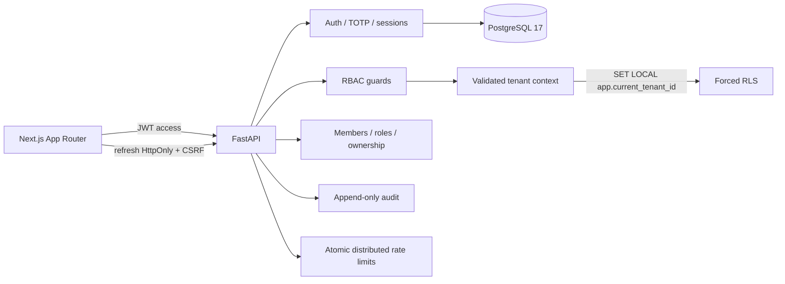
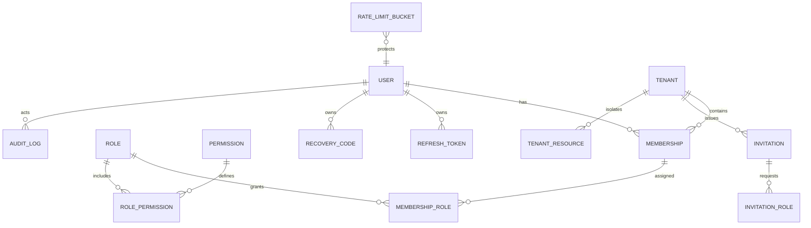

# Módulo 1 — Identidad y Multi-Tenant

## Estado

**Estado Módulo 1: CERRADO.** Cierre formal validado localmente y mediante GitHub-hosted el 2026-07-14.

| Campo | Evidencia de cierre |
|---|---|
| Repositorio | `ippiX1992/nexus` |
| Commit validado | `49bfea76ff2c940e2e56ee41d37dfbef1fc7b38d` |
| Workflow | `Nexus Modules 1-2 Quality Gate` |
| Run ID | `29365183544` |
| Resultado | `success` |
| Jobs | `backend-quality`, `frontend-quality`, `playwright-e2e`, `modules-1-2-gate` |
| Artifacts | `nexus-backend-evidence`, `nexus-playwright-evidence` |

La matriz final equivalente obtuvo 47 pruebas backend aprobadas, 81.00% de cobertura, Ruff y mypy aprobados, 13 pruebas frontend aprobadas y 1 omitida, E2E Chromium real aprobado, wheel/sdist backend y build Next.js correctos.

No se implementó ningún módulo de ecommerce, catálogo, CMS o constructor visual.

## Arquitectura



La capa `application` contiene políticas y servicios; `api` contiene adaptadores HTTP; `infrastructure` contiene SQLAlchemy, contexto transaccional y PostgreSQL. Los guards vuelven a consultar membresía, roles y permisos: las claims del JWT no son autoridad final.

## Modelo de datos



Tablas: `users`, `tenants`, `memberships`, `roles`, `permissions`, `role_permissions`, `membership_roles`, `refresh_tokens`, `recovery_codes`, `invitations`, `invitation_roles`, `audit_logs`, `tenant_resources` y `rate_limit_buckets`.

## Roles PostgreSQL y RLS

- `nexus_migrator`: propietario de estructura; ejecuta Alembic.
- `nexus_app`: `NOSUPERUSER`, `NOCREATEDB`, `NOCREATEROLE`, `NOINHERIT`, `NOBYPASSRLS`.
- `nexus_test`: orquestador local de pruebas, separado del usuario de aplicación.

`tenant_resources` tiene `ENABLE ROW LEVEL SECURITY`, `FORCE ROW LEVEL SECURITY` y política simétrica `USING`/`WITH CHECK`. El contexto se establece mediante `set_config(..., true)`, equivalente a `SET LOCAL`, y desaparece al cerrar la transacción. Las pruebas verifican SELECT, consulta por ID, INSERT cruzado, UPDATE, DELETE, SQL directo, ausencia de contexto, intento de desactivar RLS y reutilización de una conexión del pool.

Las tablas del control plane (`memberships`, roles e invitaciones) se protegen mediante guards con membresía activa porque participan en el bootstrap de selección de tenant. Los recursos de futuros módulos deberán adoptar RLS antes de incorporarse.

## Flujos de seguridad

### Login y 2FA

1. Correo normalizado y contraseña Argon2.
2. Si TOTP está habilitado solo se emite challenge de cinco minutos.
3. Se acepta TOTP o recovery code Argon2 de un solo uso.
4. Se crea una sesión únicamente después del segundo factor.
5. Setup, activación, regeneración y desactivación están auditados; desactivar revoca sesiones.

El secreto TOTP se cifra en reposo. Los recovery codes se muestran una sola vez y regenerarlos invalida los anteriores.

### Refresh

Cada fila conserva `jti`, usuario, familia, hash SHA-256, timestamps, reemplazo, IP, user-agent y razón de revocación. `SELECT ... FOR UPDATE` serializa la rotación. Reutilizar A después de producir B revoca la familia completa; la prueba concurrente confirma exactamente un `200`, un `401`, ninguna sesión activa y un evento `auth.refresh_reuse`.

### Tenant y RBAC

`GET /me/tenants` devuelve membresías activas. `select-tenant` valida usuario, tenant y membresía antes de emitir contexto. Cada request contextual vuelve a consultar la membresía y los permisos. Roles iniciales: owner, admin, manager, editor, analyst y viewer. El último owner no puede desactivarse, degradarse ni eliminarse. La transferencia bloquea ambas membresías, exige owner, contraseña reciente y TOTP cuando corresponde, y cambia los roles atómicamente.

### Invitaciones

El token usa 256 bits aleatorios y solo se persiste su hash. Expira en siete días; duplicados activos se rechazan. Reenvío rota el token; cancelación y aceptación son auditadas. El token solo se incluye en respuesta en desarrollo/pruebas; en producción el adaptador de entrega debe enviarlo fuera de banda.

### CSRF

Refresh, logout, logout global, desactivación/regeneración 2FA y transferencia emplean cookie `HttpOnly` para refresh, cookie legible de CSRF, encabezado `X-CSRF-Token`, comparación constante y allowlist estricta de `Origin`. `SameSite=Lax` y `Secure` en producción son defensas adicionales.

### Rate limiting

Los buckets se actualizan con UPSERT atómico de PostgreSQL, por lo que funcionan con múltiples instancias. Las claves se hashean y combinan IP, correo, challenge, usuario o token según el endpoint. Login, registro, refresh, challenge 2FA, setup/enable y aceptación de invitaciones están cubiertos. La respuesta es `429` con `Retry-After`.

## Endpoints finales

| Área | Endpoints |
|---|---|
| Auth | `POST /auth/register`, `/auth/login`, `/auth/refresh`, `/auth/logout`, `/auth/logout-all` |
| 2FA | `POST /auth/2fa/verify`, `/setup`, `/enable`, `/disable`, `/recovery-codes/regenerate` |
| Sesiones | `GET /auth/sessions`, `DELETE /auth/sessions/{id}` |
| Contexto | `GET /me`, `/me/tenants`, `/me/context`, `POST /auth/select-tenant` |
| Miembros | `GET /members`, `PATCH/DELETE /members/{id}`, `PUT /members/{id}/roles` |
| Invitaciones | `POST /members/invitations`, `/invitations/accept`, `/invitations/{id}/resend`, `DELETE /invitations/{id}` |
| Roles | `GET/POST /roles`, `GET/PATCH/DELETE /roles/{id}`, `PUT /roles/{id}/permissions`, `GET /permissions` |
| Propiedad | `POST /tenant/transfer-ownership` |

Todos llevan el prefijo `/api/v1`.

## Frontend

Next.js 16.2.10, App Router y TypeScript estricto. Pantallas conectadas: registro, login, desafío 2FA, selector, dashboard, perfil, seguridad, sesiones, miembros y roles. El refresh permanece en cookie HttpOnly. El cliente añade CSRF y realiza una única renovación automática ante `401`. Vitest valida sesión/CSRF/error/refresh y un flujo real registro → login → membresías → selección → contexto contra FastAPI y PostgreSQL.

## Entorno reproducible sin Docker

Variables:

```text
DATABASE_URL=
TEST_DATABASE_URL=
DATABASE_MIGRATION_URL=
TEST_DATABASE_MIGRATION_URL=
JWT_SECRET=
ALLOWED_ORIGINS=
COOKIE_SECURE=
NEXUS_TEST_PG_PORT=
POSTGRES_BIN=
```

Scripts:

```powershell
.\.venv\Scripts\python scripts/setup_test_db.py
.\.venv\Scripts\python scripts/reset_test_database.py
.\.venv\Scripts\python scripts/run_integration_tests.py
```

El clúster aislado usa `.pgtest/`, escucha solo en `127.0.0.1:55432` y no altera PostgreSQL 16/17 existente. `create_database_roles.sql` es idempotente.

## Resultados exactos

| Criterio | Estado | Evidencia | Comando o prueba |
|---|---|---|---|
| PostgreSQL real | Verificado | PostgreSQL 17, puerto aislado | `scripts/setup_test_db.py` |
| Upgrade/downgrade/upgrade | Verificado | tres operaciones exitosas | `test_migrations.py` + Alembic CLI |
| Contrato de esquema | Verificado | tablas, PK/FK/unique, índices, UUID, defaults | `test_downgrade_upgrade_and_schema_contract` |
| RLS dos tenants | Verificado | acceso cruzado bloqueado | `test_rls.py` |
| Sin BYPASSRLS | Verificado | `(rolsuper, rolbypassrls) = (false, false)` | `test_migrations.py` |
| Contaminación pool | Verificado | conexión reutilizada sin contexto devuelve cero filas | `test_pool_connection_does_not_leak_tenant` |
| Refresh/Reuse | Verificado | familia revocada y auditoría | `test_api.py` |
| Concurrencia refresh | Verificado | un 200, un 401, cero sucesores activos | `test_refresh_concurrency.py` |
| API real | Verificado | HTTPX ASGI + PostgreSQL | 47 pruebas backend en la matriz final |
| Miembros/roles/owner | Verificado | CRUD, tenant guards, último owner, transferencia | `test_admin_api.py` |
| 2FA | Verificado | setup, TOTP, recovery único, regenerate, disable | `test_security_flows.py` |
| Rate limit | Verificado | límite, separación de clave, Retry-After | `test_rate_limit.py` |
| CSRF | Verificado | ausente, incorrecto, origen ajeno, válido | `test_csrf.py` |
| Frontend conectado | Verificado | flujo real cliente UI/API/PostgreSQL | `RUN_E2E=1 npm test` |
| E2E Chromium real | Verificado | navegador oficial, API, frontend y PostgreSQL | `playwright-e2e` |
| CI | Configurado | El gate actual conserva este baseline y añade M3.0 | `.github/workflows/modules-1-2-catalog-foundation-quality-gate.yml` |
| CI GitHub-hosted | Verificado | Run `29365183544`, resultado `success` | workflow `Nexus Modules 1-2 Quality Gate` |

Resultados:

```text
Pytest: 47 passed
Cobertura: 81.00% (threshold 80%)
Ruff: All checks passed!
mypy: Success: no issues found in 46 source files
Alembic upgrade: exitoso sobre PostgreSQL vacío
Alembic downgrade: exitoso hasta base
Pruebas RLS y concurrencia: aprobadas
Pruebas frontend: 13 passed, 1 skipped
E2E Chromium real: aprobado
Build Next.js: compilación y 20 rutas generadas
Build backend: sdist y wheel generados
CI GitHub-hosted: Run 29365183544, success
Artifacts: nexus-backend-evidence, nexus-playwright-evidence
```

Se generaron `coverage.xml` y `htmlcov/`.

## Comandos finales

```powershell
.\.venv\Scripts\python -m pytest -q --cov=app --cov-report=term-missing --cov-report=xml --cov-report=html --cov-fail-under=80
.\.venv\Scripts\python -m ruff check app tests scripts --select F,I,UP,B
.\.venv\Scripts\python -m mypy app
.\.venv\Scripts\python -m build --no-isolation
cd frontend
npm.cmd run lint
npm.cmd run typecheck
$env:RUN_E2E='1'; npm.cmd test
npm.cmd run build
```

Docker continúa disponible como opción mediante `docker compose up --build`; la validación local ya no depende de Docker Desktop.

## Riesgos conocidos

- La clave TOTP debe migrar a KMS/envelope encryption y separarse de la clave JWT.
- La entrega de invitaciones en producción necesita un adaptador de email; nunca debe exponer el token en la respuesta.
- El access token reside en `sessionStorage`; un BFF con cookie HttpOnly reduciría riesgo XSS.
- Los buckets vencidos requieren una tarea periódica de limpieza.
- `npm audit` reporta dos avisos moderados heredados de PostCSS dentro de Next.js 16.2.10; no existe corrección ascendente segura reportada por npm al momento de esta validación.
- La auditoría append-only no es todavía criptográficamente inmutable.
- La migración histórica `0001` depende de metadata dinámica y requiere una estrategia futura de consolidación.

## Checklist de cierre

- [x] PostgreSQL real, migraciones y downgrade/upgrade.
- [x] RLS, pool y usuario sin BYPASSRLS.
- [x] Refresh, reutilización y concurrencia.
- [x] API, RBAC, miembros, roles y transferencia.
- [x] 2FA completo, rate limiting y CSRF.
- [x] Cobertura ≥80%, Ruff, mypy y builds.
- [x] Frontend conectado con integración real automatizada.
- [x] CI reproducible configurado con PostgreSQL y Redis.
- [x] Ejecución del workflow en GitHub-hosted runner.
- [x] E2E Chromium real en GitHub-hosted.
