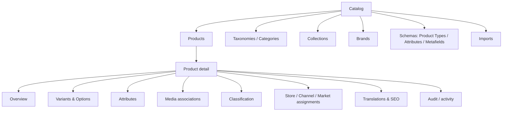

# Módulo 3 — Catalog Core: plan de implementación

> Tipo de entrega: análisis, arquitectura y planificación exclusivamente.
> Estado del módulo: **PLANIFICADO — NO IMPLEMENTADO**.
> Rama de planificación: `feature/catalog-core`.
> Baseline verificado: `0642cd827826c61855e4695a6f0589c653095fa1`.

## 1. Estado base y evidencia

| Elemento | Estado verificado |
|---|---|
| Repositorio | `ippiX1992/nexus` |
| Rama estable | `main`, sincronizada con `origin/main` antes de crear la rama |
| Commit de cierre | `0642cd827826c61855e4695a6f0589c653095fa1` |
| Módulo 1 | CERRADO — `module-1-identity-v1.0.0` |
| Módulo 2 | CERRADO — `module-2-platform-kernel-v1.0.0` |
| Plataforma | `nexus-platform-v0.2.0` |
| Quality gate base | GitHub-hosted aprobado |
| Worktree inicial | Limpio |

Los Módulos 1 y 2 permanecen cerrados. Catalog se construirá sobre sus contratos; no se reescriben Identity, tenancy, RBAC, RLS, audit, scopes, idempotency, outbox/inbox, entitlements, Operations ni Jobs.

## 2. Resumen ejecutivo

Se recomienda construir Catalog Core como un bounded context tenant-owned dentro del monolito modular. El master Product se comparte entre todas las Stores del tenant y se vincula a Store, Channel y Market mediante assignments explícitos. No se crea todavía una entidad contenedora `Catalog` ni se registra cada Product en `platform_resource_scopes`.

La Variant es siempre la unidad vendible: incluso un producto simple tiene una Variant default. SKU es único en el tenant y permanece reservado al archivar. Attributes descriptivos, Options generadoras de variantes y Metafields extensibles se modelan por separado. Categories son jerárquicas dentro de Taxonomies; Collections son manuales inicialmente. `active` expresa madurez editorial, mientras que publication eligibility se evalúa para un target Platform y no equivale a published.

El primer incremento funcional futuro debe empezar por foundation de datos/RLS/RBAC y el vertical Product–Variant, no por una UI amplia ni por importadores. Cada slice debe cerrar migración, dominio, API, eventos, administración y pruebas antes de ampliar superficie.

## 3. Objetivos

- Definir una identidad de producto reutilizable en múltiples Stores.
- Soportar productos simples y configurables sin modelos paralelos.
- Mantener datos maestros, traducciones, SEO, clasificación e identificadores.
- Proteger aislamiento tenant mediante RLS y FKs compuestas.
- Permitir asignaciones coherentes con Store/Channel/Market del Kernel.
- Producir eventos versionados y proyecciones futuras sin acceso a tablas privadas.
- Escalar a millones de Products con cursor pagination e índices tenant-leading.
- Establecer contratos futuros de Assets, Search e importación sin implementarlos prematuramente.

## 4. Trabajo excluido

No forma parte de Módulo 3:

- Pricing, price lists, costos, promociones, impuestos o moneda comercial;
- Inventory, stock, reservas, warehouses o availability física;
- CMS, navegación, páginas, Builder, themes o rendering;
- publicación/deployment por Environment;
- carrito, Checkout, Orders, Payments, Shipping o fulfillment;
- almacenamiento binario, CDN o transformación de Assets;
- Elasticsearch, Meilisearch u otro motor de búsqueda;
- automatic Collections y su rule engine;
- parsers/importadores CSV, XLSX, Shopify, PrestaShop, VTEX o ERP;
- marketplace feeds;
- bundles/kits;
- branch, código, migraciones, endpoints, UI o pruebas en esta entrega documental.

## 5. Decisiones principales

| Decisión | Alternativas | Recomendación | Motivo | Riesgo |
|---|---|---|---|---|
| Ownership de Product | Tenant; Store; entidad Catalog | Tenant-owned master con assignments | Reutilización multitienda y una identidad ERP | Overrides por Store requerirán un contrato posterior |
| Entidad `Catalog` | Crear root contenedor; no crear | No crear en v1 | No hay un caso que justifique nueva cardinalidad/jerarquía | B2B catalogs futuros necesitarán una capa adicional |
| Scope registry | Product como resource scope; RLS propio | No insertar Products en registry | Evita millones de filas y hot paths globales | Autorización fine-grained por Product no estará en v1 |
| Producto simple | Sin Variant; Variant opcional; default | Variant default obligatoria | Unifica SKU y dependencias futuras | Migraciones externas deben mapear siempre Variant |
| Combinaciones | Cartesiano automático; explícitas | Preview + confirmación explícita | Evita explosiones y variantes accidentales | UX necesita guiar selección parcial |
| SKU uniqueness | Global; tenant; store | Tenant-wide, normalizada | Compatible con ERP y producto compartido | Fusión de catálogos con duplicados exige homologación |
| Reutilización de SKU | Liberar al archivar; reservar | Reservar incluso archivado | Evita reidentificación histórica | Un error de SKU exige corrección controlada |
| Categories | Adjacency; materialized path; closure | Adjacency + closure table | Lectura eficiente y detección de ciclos | Movimientos de subtrees son transacciones más complejas |
| Collections | Manual + rules JSON; manual | Manual inicialmente | Evita rule language inseguro/no versionado | Menor automatización editorial inicial |
| Attributes | EAV genérico; columnas fijas; tipado | Definiciones + valores tipados | Flexibilidad gobernada y filtros previsibles | Más tablas y validaciones |
| Options | Reutilizar Attributes; separar | Separar por Product | Semántica de combinaciones clara | Sin catálogo global de opciones en v1 |
| Metafields | JSON libre; esquema controlado | Definitions + JSON validado | Extensible sin perder gobernanza | Indexación requiere declarar intención |
| Publicación | `active = published`; target-based | Eligibility target-based | Multi-store/channel/market/environment correcto | Requiere composición futura con Pricing/Inventory |
| Site/Environment assignments | Persistir todos; derivar | Site vía Channel; Environment en publicación | Evita duplicar grafo Platform | Queries de elegibilidad dependen de Platform |
| Media | URLs/blobs; Asset references | Asociaciones a asset IDs por port | Ownership claro y lifecycle desacoplado | Bloqueado hasta contrato mínimo de Assets |
| Delete | Hard delete; archive | Archive de roots | Historial, integraciones y referencias futuras | Requiere política de purge separada |
| Listados | Offset; cursor | Keyset cursor desde el inicio | Escala y estabilidad bajo escritura | UX no tendrá salto arbitrario de página |
| Search | Consultas SQL libres; engine inmediato; contract | Projection contract, engine futuro | No introduce infraestructura prematura | Búsqueda avanzada no forma parte del primer slice |

## 6. Boundary y entidades

El detalle normativo está en:

- [Catalog Domain](../architecture/catalog-domain.md)
- [Catalog Data Model](../architecture/catalog-data-model.md)
- [Catalog Events](../architecture/catalog-events.md)

### 6.1 Aggregate roots

- Product;
- Product Type;
- Taxonomy;
- Collection;
- Brand;
- Metafield Definition;
- Product Assignment como consistency boundary para Store/Channel/Market.

### 6.2 Entidades internas principales

- Variant;
- Product Option y Option Value;
- Attribute Definition y valores tipados;
- Category y closure paths;
- traducciones y SEO;
- Variant Identifier;
- Product/Variant Media Association;
- Tag y asociaciones;
- assignments Store/Channel/Market.

### 6.3 Invariantes no negociables

- Todo Product tiene al menos una Variant.
- Solo una Variant default por Product simple.
- Una Variant activa tiene SKU no vacío y normalizado.
- SKU y combinaciones son únicos en el scope definido.
- Una Variant selecciona un valor por cada Option activa, sin duplicados.
- Un Product archived no acepta nuevas Variants activas ni assignments activos.
- Toda relación interna conserva tenant y, si aplica, Product/Store padre.
- Una Category no es su propio ancestro y no se mueve bajo un descendiente.
- Un Channel/Market assignment depende de un Store assignment del mismo tenant/store.
- Un slug es único dentro de su namespace localizado.
- No se borra físicamente un root publicado/referenciado.
- Una mutación de estado y su outbox event confirman o revierten juntos.

## 7. Multi-tenancy, RLS y jerarquía

### 7.1 Scope

- Product master, Product Type, Taxonomy, Collection, Brand, Tag y Metafield Definition: tenant scope.
- Variant/Option/value/translation/SEO/media: tenant + Product.
- Category: tenant + Taxonomy.
- Store assignment: tenant + Product + Store.
- Channel/Market assignment: tenant + Product + Store + target.

`store_id` solo aparece en assignments. No se usa para ownership del master ni como policy RLS primaria.

### 7.2 Policies

Todas las tablas `catalog_*` requieren `ENABLE ROW LEVEL SECURITY` y `FORCE ROW LEVEL SECURITY`, con SELECT/INSERT/UPDATE/DELETE policies separadas. RLS usa el tenant context canónico. Application authorization aplica permissions y resource hierarchy antes de mutar.

Workers:

1. Reclaman jobs sin mezclar datos de negocio.
2. Abren transacción por tenant/batch.
3. Establecen tenant context con el mecanismo del Kernel.
4. Revalidan Operation/job lease y actor/correlation.
5. Procesan una cantidad acotada.
6. Commit/rollback y limpian contexto antes de devolver conexión al pool.

Nunca se ejecuta un import multi-tenant dentro de una transacción con RLS deshabilitado.

### 7.3 Escenarios de ataque/error

| Escenario | Defensa | Resultado esperado |
|---|---|---|
| Leer Product UUID de otro tenant | RLS + query tenant-scoped | 404 sin revelar existencia; audit de intento si es mutación |
| Vincular Category ajena | RLS + FK `(tenant_id, category_id)` | 404/`catalog.category_not_found`; rollback |
| Asignar a Store ajena | Platform lookup tenant-scoped + FK compuesta | 404/`catalog.store_not_found`; sin outbox |
| SKU igual en otro tenant | Unique incluye tenant | Permitido |
| SKU duplicado en el mismo tenant | Normalización + unique DB | 409 `catalog.sku_conflict` |
| Manipular Variant de otro Product | FK/query `(tenant, product, variant)` | 404 `catalog.variant_not_found` |
| Channel de otra Store | FK `(tenant, store, channel)` + parent assignment | 422 `catalog.assignment_hierarchy_invalid` |
| Filtro con ID cross-tenant | Join siempre anclado a tenant | Cero resultados, sin side channel |
| Pool reutilizado | transaction-local context + reset tests | Sin filtración entre requests |
| Worker sin tenant context | FORCE RLS | Cero lecturas/escrituras bloqueadas |

## 8. API REST propuesta

### 8.1 Convenciones

- Base: `/api/v1/catalog`.
- IDs UUIDv4.
- Listados con `limit` acotado y `cursor`; respuesta `{items, next_cursor, has_more}`.
- Filtros allowlisted; no query language arbitrario.
- Todo POST/PUT/PATCH/DELETE mutante exige `Idempotency-Key`; preview/evaluation sin side effects no lo exige.
- PATCH/PUT/comandos de estado exigen además `expected_version` o `If-Match`; conflicto devuelve 409.
- `X-Correlation-ID` se valida/propaga mediante middleware existente.
- Cross-tenant y no visible se responde como 404.
- Creación 201; comando aceptado largo 202; update 200; archive/restore 200; delete de asociación 204.
- Errores propuestos: `{code, message, details, request_id}` sin romper el manejo general del API.

En las tablas siguientes los nombres de evento se abrevian por legibilidad; el contrato emitido siempre usa el nombre completo terminado en `.v1` definido en `catalog-events.md`. Los errores comunes de la sección anterior aplican a todos los endpoints y la última columna añade los específicos.

### 8.2 Códigos de error comunes

| HTTP | Code | Uso |
|---|---|---|
| 400 | `catalog.invalid_request` | Forma o cursor inválido |
| 401 | `authentication_required` | Sin sesión válida |
| 403 | `catalog.permission_denied` | Permission ausente |
| 404 | `catalog.*_not_found` | Recurso inexistente o de otro tenant |
| 409 | `catalog.version_conflict` | Optimistic concurrency |
| 409 | `catalog.sku_conflict` | SKU normalizado ya reservado |
| 409 | `catalog.slug_conflict` | Slug duplicado en scope |
| 409 | `catalog.combination_conflict` | Variante duplicada |
| 409 | `idempotency_key_conflict` | Misma key, fingerprint distinto |
| 422 | `catalog.invariant_violation` | Estado o relación inválida |
| 422 | `catalog.assignment_hierarchy_invalid` | Target no pertenece al Store padre |
| 422 | `catalog.category_cycle` | Movimiento crea ciclo |
| 422 | `catalog.attribute_value_invalid` | Tipo/scope/constraint inválido |
| 429 | `entitlement_limit_exceeded` | Cuota efectiva excedida |
| 503 | `catalog.dependency_unavailable` | Platform/Assets requerido no disponible |

### 8.3 Products

| Método y ruta | Permission / scope | Request → response | Idempotencia / eventos / errores propios |
|---|---|---|---|
| `GET /products` | `catalog.product.read` / tenant | filtros status/type/brand/store/tag + cursor → `ProductSummaryPage` | No key; 400 cursor/filtro |
| `POST /products` | `catalog.product.create` / tenant | product type, handle, internal name, default variant opcional, locale base → `ProductDetail` | Key requerida; `product.created`; 409 handle/SKU, 429 products |
| `GET /products/{product_id}` | `catalog.product.read` / tenant | includes allowlisted → `ProductDetail` | No key; 404 |
| `PATCH /products/{product_id}` | `catalog.product.update` / tenant | patch + expected version → `ProductDetail` | Fingerprint idempotente recomendado; `product.updated`; 409 version |
| `POST /products/{product_id}/activate` | `catalog.publish` / tenant | expected version → status/eligibility summary | Key requerida; `status_changed`; 422 missing requirements |
| `POST /products/{product_id}/withdraw` | `catalog.product.update` / tenant | expected version, reason → Product | Key; `status_changed`; 409 version |
| `POST /products/{product_id}/archive` | `catalog.product.archive` / tenant | expected version, reason → Product | Key; `status_changed`; 422 references/policy |
| `POST /products/{product_id}/restore` | `catalog.product.archive` / tenant | expected version → Product draft | Key; `status_changed`; 409 SKU/slug |
| `POST /products/{product_id}/publication-eligibility` | `catalog.publish` / tenant + target | store/channel/market/environment/locale → diagnostic | Sin key, sin evento; 422 target inválido |

`ProductDetail` incluye master, traducciones/SEO resumidos, variants, options, classification y assignments según includes autorizados; no incluye precios/stock.

### 8.4 Variants, Options e identificadores

| Método y ruta | Permission / scope | Request → response | Idempotencia / eventos / errores propios |
|---|---|---|---|
| `GET /products/{id}/variants` | `catalog.variant.read` / tenant+product | filtros status/SKU + cursor → page | No key; 404 Product |
| `POST /products/{id}/variants` | `catalog.variant.create` / tenant+product | SKU, combination, attributes → Variant | Key; `variant.created`; 409 SKU/combination, 429 variant limit |
| `GET /products/{id}/variants/{variant_id}` | `catalog.variant.read` | includes → Variant detail | No key; 404 |
| `PATCH /products/{id}/variants/{variant_id}` | `catalog.variant.update` | patch + expected version → Variant | Key/fingerprint; `variant.updated`; 409 version/SKU |
| `POST .../variants/{variant_id}/activate` | `catalog.variant.update` | expected version → Variant | Key; `variant.status_changed`; 422 invalid |
| `POST .../variants/{variant_id}/archive` | `catalog.variant.update` | expected version, reason → Variant | Key; status event; 422 last variant/reference |
| `PUT .../variants/{variant_id}/identifiers` | `catalog.variant.update` | full identifier set + expected version → Variant | Key; `variant.updated`; 409 identifier |
| `POST /products/{id}/variant-combinations/preview` | `catalog.variant.create` | selected option value sets → count/conflicts/combinations page | Sin side effect/key; 422 quota/explosion |
| `POST /products/{id}/variant-combinations` | `catalog.variant.create` | preview token, selected combinations, defaults → Operation/result | Key; variant events; 409 changed preview, 429 quota |
| `GET /products/{id}/options` | `catalog.variant.read` | — → options/values | No key |
| `POST /products/{id}/options` | `catalog.variant.update` | key, translations, values, position → Option | Key; `product.options_changed`; 409 key |
| `PATCH /products/{id}/options/{option_id}` | `catalog.variant.update` | patch/version → Option | Key; options event; 409/422 combinations |
| `POST .../options/{option_id}/values` | `catalog.variant.update` | key/translations/swatch → Option Value | Key; options event; 409 key |
| `PATCH .../option-values/{value_id}` | `catalog.variant.update` | patch/version → Option Value | Key; options event; 422 active variants |
| `POST .../option-values/{value_id}/archive` | `catalog.variant.update` | expected version → archived value | Key; options event; 422 references |

La ruta abreviada `...` conserva `/products/{id}`. El endpoint de generación puede ser síncrono para pocos elementos y devolver 202+Operation al superar un threshold, sin cambiar el contrato de idempotencia.

### 8.5 Product Types, Attributes y Metafields

| Método y ruta | Permission / scope | Request → response | Idempotencia / eventos / errores propios |
|---|---|---|---|
| `GET /product-types` | `catalog.schema.read` / tenant | status + cursor → page | No key |
| `POST /product-types` | `catalog.schema.manage` / tenant | key/name → Product Type | Key; `product_type.changed`; 409 key |
| `GET /product-types/{id}` | `catalog.schema.read` | includes definitions → detail | No key |
| `PATCH /product-types/{id}` | `catalog.schema.manage` | patch/version → detail | Key; schema event; 409 version |
| `POST /product-types/{id}/attributes` | `catalog.schema.manage` | typed definition/constraints/translations → definition | Key; schema event; 409 key, 422 schema |
| `PATCH .../attributes/{attribute_id}` | `catalog.schema.manage` | safe patch/version → definition | Key; schema event; 422 incompatible values |
| `POST .../attributes/{attribute_id}/archive` | `catalog.schema.manage` | version/replacement strategy → result/Operation | Key; schema event; 422 required/in-use |
| `PUT /products/{id}/attribute-values` | `catalog.product.update` | values + expected version → validation/result | Key; `product.updated`; 422 typed values |
| `PUT .../variants/{variant_id}/attribute-values` | `catalog.variant.update` | values + expected version → validation/result | Key; `variant.updated`; 422 typed values |
| `GET /metafield-definitions` | `catalog.schema.read` | target/namespace + cursor → page | No key |
| `POST /metafield-definitions` | `catalog.schema.manage` | namespace/key/type/validation → definition | Key; definition event; 409 key |
| `PATCH /metafield-definitions/{id}` | `catalog.schema.manage` | safe patch/version → definition | Key; definition event; 422 incompatible |
| `PUT /products/{id}/metafields` | `catalog.product.update` | values + expected version → Product extension view | Key; Product event; 422 validation |
| `PUT .../variants/{variant_id}/metafields` | `catalog.variant.update` | values/version → Variant extension view | Key; Variant event; 422 validation |

El permiso adicional `catalog.schema.*` es necesario para no mezclar gobernanza de definiciones con edición cotidiana de productos.

### 8.6 Traducciones, SEO y media

| Método y ruta | Permission / scope | Request → response | Idempotencia / eventos / errores propios |
|---|---|---|---|
| `PUT /products/{id}/translations/{locale}` | `catalog.product.update` / tenant+product | title/descriptions/version → translation | Key; Product updated; 422 locale/quota |
| `PUT /products/{id}/seo/{locale}` | `catalog.product.update` | slug/meta/version → SEO | Key; Product/slug event; 409 slug |
| `DELETE /products/{id}/translations/{locale}` | `catalog.product.update` | expected version → 204 | Key; Product updated; 422 required locale |
| `POST /products/{id}/media` | `catalog.media.manage` | asset ID/role/position/alt → association | Key; media event; 409 primary, 503 Assets |
| `PATCH /products/{id}/media/{media_id}` | `catalog.media.manage` | role/order/alt/version → association | Key; media event |
| `DELETE /products/{id}/media/{media_id}` | `catalog.media.manage` | expected version → 204 | Key; media event |
| `POST .../variants/{variant_id}/media` | `catalog.media.manage` | asset ID/role/position/alt → association | Key; variant media event |
| `PATCH .../variants/{variant_id}/media/{media_id}` | `catalog.media.manage` | patch/version → association | Key; variant media event |
| `DELETE .../variants/{variant_id}/media/{media_id}` | `catalog.media.manage` | expected version → 204 | Key; variant media event |

Media endpoints no se habilitan hasta que `AssetReferencePort` tenga un adapter explícito. No aceptan URLs arbitrarias.

### 8.7 Taxonomies y Categories

| Método y ruta | Permission / scope | Request → response | Idempotencia / eventos / errores propios |
|---|---|---|---|
| `GET /taxonomies` | `catalog.taxonomy.read` / tenant | cursor/status → page | No key |
| `POST /taxonomies` | `catalog.taxonomy.manage` | key/purpose/depth/translations → Taxonomy | Key; taxonomy event; 409 key |
| `PATCH /taxonomies/{id}` | `catalog.taxonomy.manage` | patch/version → Taxonomy | Key; taxonomy event |
| `GET /taxonomies/{id}/categories` | `catalog.category.read` | parent/depth/cursor → nodes/page | No key; 400 depth |
| `POST /taxonomies/{id}/categories` | `catalog.category.manage` | parent/key/translations/position → Category | Key; category.created; 409 key/slug, 429 category quota |
| `GET /categories/{id}` | `catalog.category.read` | ancestors/children includes → detail | No key |
| `PATCH /categories/{id}` | `catalog.category.manage` | metadata/version → Category | Key; category.updated |
| `POST /categories/{id}/move` | `catalog.category.manage` | new parent/position/version → subtree summary | Key; category.moved; 409 version, 422 cycle/depth |
| `POST /categories/{id}/archive` | `catalog.category.manage` | version/child strategy → result | Key; category.updated; 422 children/assignments |
| `PUT /products/{id}/categories` | `catalog.product.update` | complete assignments per taxonomy/version → Product classification | Key; categories_changed; 422 cross-tenant |

### 8.8 Collections, Brands y tags

| Método y ruta | Permission / scope | Request → response | Idempotencia / eventos / errores propios |
|---|---|---|---|
| `GET /collections` | `catalog.collection.read` / tenant | status/cursor → page | No key |
| `POST /collections` | `catalog.collection.manage` | key/translations → Collection | Key; collection.created; 409 key/slug, 429 quota |
| `GET /collections/{id}` | `catalog.collection.read` | members cursor/include → detail | No key |
| `PATCH /collections/{id}` | `catalog.collection.manage` | patch/version → Collection | Key; collection.updated |
| `POST /collections/{id}/archive` | `catalog.collection.manage` | version → Collection | Key; collection.updated |
| `PUT /collections/{id}/products` | `catalog.collection.manage` | membership diff/order/version → summary | Key; membership_changed; 422 invalid Product |
| `GET /brands` | `catalog.brand.read` / tenant | status/search/cursor → page | No key |
| `POST /brands` | `catalog.brand.manage` | key/name/translations → Brand | Key; brand.changed; 409 key/slug |
| `PATCH /brands/{id}` | `catalog.brand.manage` | patch/version → Brand | Key; brand.changed |
| `POST /brands/{id}/archive` | `catalog.brand.manage` | version → Brand | Key; brand.changed; 422 active use policy |
| `PUT /products/{id}/tags` | `catalog.product.update` | normalized tag set/version → Product tags | Key; product.updated |

No se expone automatic Collection en v1.

### 8.9 Assignments

| Método y ruta | Permission / scope | Request → response | Idempotencia / eventos / errores propios |
|---|---|---|---|
| `GET /products/{id}/assignments` | `catalog.product.read` / tenant | store/channel/market filters → assignment tree | No key |
| `PUT /products/{id}/stores/{store_id}` | `catalog.assignment.manage` / tenant+store | status/window/version → Store assignment | Key; store assignment event; 422 hierarchy |
| `POST .../stores/{store_id}/archive` | `catalog.assignment.manage` | version/reason → assignment | Key; assignment event; cascades logical children |
| `PUT .../stores/{store_id}/channels/{channel_id}` | `catalog.assignment.manage` / tenant+store+channel | status/window/version → Channel assignment | Key; channel event; 422 relation |
| `POST .../channels/{channel_id}/archive` | `catalog.assignment.manage` | version → assignment | Key; channel event |
| `PUT .../stores/{store_id}/markets/{market_id}` | `catalog.assignment.manage` / tenant+store+market | status/window/version → Market assignment | Key; market event; 422 relation |
| `POST .../markets/{market_id}/archive` | `catalog.assignment.manage` | version → assignment | Key; market event |

Activar un assignment puede requerir además `catalog.publish`; editarlo en draft solo `catalog.assignment.manage`. El service autoriza ambos de manera explícita.

### 8.10 Importación futura mediante Operations

| Método y ruta | Permission / scope | Request → response | Idempotencia / eventos / errores propios |
|---|---|---|---|
| `POST /imports` | `catalog.import.manage` / tenant | manifest/mapping/mode/dry run/source reference → 202 Operation | Key obligatoria; import.accepted; 422 manifest, 429 concurrency |
| `GET /imports` | `catalog.import.read` | status/source/cursor → import summaries | No key |
| `GET /imports/{import_id}` | `catalog.import.read` | — → progress/counts/checkpoints | No key; 404 |
| `GET /imports/{import_id}/errors` | `catalog.import.read` | cursor/severity/code → row errors | No key |
| `POST /imports/{import_id}/cancel` | `catalog.import.manage` | reason → Operation | Key; Operation event; 409 terminal |
| `POST /imports/{import_id}/rollback` | `catalog.import.manage` | expected import version/scope → 202 Operation | Key; rollback event; 422 conflicts |

Son contratos reservados. No se implementan parsers en el primer slice de Catalog.

## 9. RBAC propuesto

### 9.1 Permissions

Mínimas solicitadas:

- `catalog.product.read`, `.create`, `.update`, `.archive`;
- `catalog.variant.read`, `.create`, `.update`;
- `catalog.category.read`, `.manage`;
- `catalog.collection.read`, `.manage`;
- `catalog.brand.read`, `.manage`;
- `catalog.assignment.manage`;
- `catalog.publish`.

Adicionales necesarias para boundaries claros:

- `catalog.schema.read`, `catalog.schema.manage` para Product Type, Attribute y Metafield Definition;
- `catalog.taxonomy.read`, `catalog.taxonomy.manage`;
- `catalog.media.manage`;
- `catalog.import.read`, `catalog.import.manage`.

No se crea un permiso por Product ni filas resource scope por producto. Las acciones Store-scoped combinan permission global persistida y validación de la jerarquía del recurso.

### 9.2 Grants sugeridos a system roles

| Rol | Grants nuevos propuestos |
|---|---|
| Owner | Todos |
| Admin | Todos |
| Manager | Reads; product/variant create/update; category/collection/brand/taxonomy manage; assignment/media; publish; import read/manage. Sin schema manage ni product archive por defecto |
| Editor | Reads; product/variant create/update; category/collection/brand/media manage. Sin publish, assignment active, archive, schema ni import manage |
| Analyst | Todos los `*.read`, incluido import read; sin mutaciones |
| Viewer | Product/variant/category/collection/brand/taxonomy/schema read; sin import evidence sensible por defecto |
| Custom roles | Ningún grant automático |

Los grants se añadirán en una migración explícita y en los seeds de tenants nuevos de forma atómica. No se cambian roles existentes en esta fase. Antes de implementar debe aprobarse el principio de least privilege, especialmente `catalog.publish`, archive e import.

## 10. Idempotencia y concurrencia

- Se reutiliza la identidad `(tenant_id, actor_id, method, endpoint, key)` del Kernel.
- Fingerprint usa JSON canónico, parámetros de ruta relevantes y content type.
- Misma key+fingerprint reproduce status/body; misma key distinta devuelve 409.
- Retención inicial: política existente de 24 horas, ajustable para imports largos mediante Operation identity estable.
- Idempotency no reemplaza unique constraints.
- Comandos con estado usan expected aggregate version.
- SKU, slug y combination se resuelven finalmente por constraints DB; se traduce violation a error estable.
- La generación de variantes usa preview token ligado a Product version y hash de Options. Si cambia, se rechaza.
- Imports usan `source_system + source_record_key + mapping_version` como dedupe de negocio además de HTTP key.

## 11. Eventos

Catalog usa el envelope existente y outbox transaccional. Familias principales:

- `catalog.product.*.v1`;
- `catalog.variant.*.v1`;
- `catalog.product.options_changed.v1`;
- `catalog.product_type.changed.v1`;
- `catalog.taxonomy.*.v1` y `catalog.category.*.v1`;
- `catalog.collection.*.v1`;
- `catalog.brand.changed.v1`;
- `catalog.product.*_assignment_changed.v1`;
- `catalog.product.eligibility_invalidated.v1`;
- `catalog.product.media_changed.v1` y Variant equivalente;
- `catalog.import.*.v1`.

Payloads mínimos, aggregate version, correlation/causation y consumers previstos están definidos en `catalog-events.md`. Consumers deduplican por inbox y no dependen de orden global.

## 12. Contrato futuro de importación

### 12.1 Fuentes

- CSV y XLSX cargados mediante un futuro Asset seguro;
- API push/pull;
- ERP genérico mediante connector;
- PrestaShop;
- Shopify;
- VTEX.

Cada connector transforma a un `CatalogImportRecord v1` canónico; no escribe repositorios directamente.

### 12.2 Manifest

Un manifest versionado declara:

- source type, source system e import ID;
- asset/reference y checksum, nunca ruta local arbitraria;
- encoding, delimiter/sheet cuando corresponda;
- mapping version y field mappings;
- locale/default locale;
- identity strategy: SKU, external namespace/code o source Product ID;
- mode: create-only, update-only o upsert;
- conflict policy: fail, skip o explicit merge;
- desired Store/Channel/Market assignments;
- dry run;
- batch size solicitado dentro de límites;
- actor/correlation/idempotency.

### 12.3 Pipeline durable


- Cada fila tiene source row key, normalized identity, result code y safe diagnostics.
- Un batch no cruza tenants y confirma agregados individualmente o en grupos pequeños.
- Errores por fila no necesariamente abortan el import; threshold/policy decide.
- Retry no duplica Products gracias a source identity, SKU constraints e idempotency.
- Operations exponen progreso, cancelación cooperativa, leases y resultado.
- Report contiene counts y errores sanitizados; archivos de evidencia futuros pertenecen a Assets.

### 12.4 Homologación de SKU

1. Normalizar sin perder original.
2. Resolver external mapping del mismo source namespace.
3. Comparar SKU tenant-wide.
4. Si external mapping y SKU apuntan a Variants distintas, marcar conflicto; no fusionar automáticamente.
5. Dry run muestra create/update/conflict.
6. Los cambios de SKU requieren política explícita y conservan alias/evidencia de importación futura.

### 12.5 Rollback lógico

No se promete rollback ACID de una importación ya confirmada. Se registra change set por import y versiones before/after suficientes para generar compensaciones:

- archivar agregados creados si no fueron modificados después;
- restaurar campos actualizados solo si su version continúa siendo la producida por el import;
- retirar assignments/memberships creados;
- marcar conflictos manuales cuando hubo ediciones posteriores;
- emitir nuevos audit/outbox events de compensación.

El rollback es otra Operation idempotente, autorizada y observable.

## 13. Entitlements

| Entitlement | Primer incremento | Decisión y punto de enforcement |
|---|---|---|
| `catalog.products.max` | Sí | Reserva/consumo en creación y bulk plan; protege cardinalidad principal |
| `catalog.variants.max_per_product` | Sí | Antes de create/generate y nuevamente bajo transacción; evita explosión cartesiana |
| `catalog.categories.max` | Medir, enforcement posterior | Baja presión inicial; métricas/counter desde el inicio evitan migración ciega |
| `catalog.collections.max` | Medir, enforcement posterior | Collections manuales no son hot path inicial |
| `catalog.languages.max` | Posponer enforcement | Requiere primero gobernanza explícita de locales compartida con Platform/CMS; mientras tanto allowlist y límites de request |

`products.max` y `variants.max_per_product` deben crearse en el mismo incremento que sus comandos. No se hace count completo en cada request: se usa el mecanismo de usage/reservation del Kernel y reconciliación. Categories, Collections y distinct locales emiten métricas desde el primer día para fijar defaults basados en uso real.

## 14. Escalabilidad

### 14.1 Consultas

- Cursor keyset, nunca offset en colecciones grandes.
- Page size default y máximo por endpoint.
- Índices tenant-leading alineados al sort estable.
- Batch loader para Product Types, Brand, assignments y Platform resources.
- `include` allowlisted con presupuestos; no graph fetch arbitrario.
- Listado admin usa summaries; detail carga subrecursos paginados.
- Filtros avanzados se reservan a Search projection; SQL no se convierte en search engine.

### 14.2 Escrituras

- UoW por aggregate y optimistic concurrency.
- Imports/jobs procesan batches acotados con checkpoint.
- No se genera producto cartesiano sin preview/quota.
- Reordering usa posiciones espaciadas o operación batch, evitando update de toda la lista cuando sea posible.
- Category subtree move bloquea solo nodos/path afectados y tiene límites de tamaño.
- Outbox se monitorea y aplica backpressure antes de saturar dispatcher.

### 14.3 Caché y consistencia

- PostgreSQL sigue siendo fuente de verdad.
- Caché futura solo para reads/projections con key tenant+version y TTL.
- Invalidación por aggregate version/event; no write-through distribuido en v1.
- Publication eligibility puede cachearse por `(tenant,target,product_version,platform_versions)`.
- Search/index es eventual y puede reconstruirse; comandos nunca leen autoridad desde él.

### 14.4 Particionamiento

No se introduce inicialmente. Se recogen cardinalidad, bloat, p95/p99 y skew por tenant. El diseño tenant-leading permite hash partitioning futuro y aislamiento de tenants outlier. Nunca se particiona Product por Store.

### 14.5 Contrato de indexación futura

`CatalogIndexProjection v1` contiene master versionado, locales, Variants activas, Brand, categorías, Collections, tags, atributos filterable y assignments efectivos. Un projector inbox-idempotent hace upsert solo si la versión aumenta y tombstone al archivar. El motor concreto se decide después de medir volumen, filtros, idiomas y SLO.

## 15. Frontend administrativo propuesto

### 15.1 Arquitectura de información



El active Store existente funciona como filtro/contexto de assignments, no como propietario oculto del Product. La UI debe mostrar siempre si la lista enseña “todos los productos del tenant” o “asignados a esta Store”.

### 15.2 Wireframe — listado

```text
┌ Nexus / Catalog / Products ───────────────────────────────────────────┐
│ Scope: [All tenant products ▼]  Store filter: [Quito ▼]  [+ Product] │
│ Search [SKU, title, handle]  Status [All] Type [All] Brand [All]      │
├──────────┬──────────────────────┬──────────┬──────────┬───────────────┤
│ Product  │ Variants / SKU       │ Status   │ Stores   │ Updated       │
│ ...      │ ...                  │ Draft    │ 2 / 4    │ ...           │
├──────────┴──────────────────────┴──────────┴──────────┴───────────────┤
│ [Load more]  cursor-based                         selection: 0        │
└───────────────────────────────────────────────────────────────────────┘
```

Search local inicial acepta filtros SQL indexados exactos/prefix limitados; la UI no promete full-text antes de Search.

### 15.3 Wireframe — creación

```text
Step 1 Product type → Step 2 Identity → Step 3 Simple or configurable
→ Step 4 Options/variant preview → Step 5 Translation base → Review

Sidebar: validation, quota, unsaved state
Footer: Save draft | Save and continue
```

Crear siempre produce draft y Variant default. “Activate” se ofrece después de ejecutar eligibility base; no se ofrece “Publish now”.

### 15.4 Wireframe — detalle

```text
┌ Product: Running Shoe                         [Draft] v12             ┐
│ Tenant catalog · Assigned to 2 stores     [Validate] [Activate] [⋯] │
├ Overview | Variants | Attributes | Media | Classification | Markets ┤
│ Translations | SEO | Activity                                       │
├──────────────────────────────────────────────────────────────────────┤
│ Context-sensitive editor + inline validation                         │
│ Right rail: eligibility reasons, assignments, last update            │
└──────────────────────────────────────────────────────────────────────┘
```

### 15.5 Pantallas específicas

- Variants: matrix de combinations, preview count, SKU conflicts y edición individual.
- Categories: tree virtualizado, drag/move con confirmación y preflight cycle/depth.
- Collections: lista manual y reorder; sin rule builder.
- Brands: CRUD localizado y uso en Products.
- Schema: Product Types/Attribute Definitions con aviso de impacto y Operations para cambios incompatibles.
- Media: selector proveniente de Assets cuando exista; no uploader improvisado.
- Assignments: árbol Store → Channels/Markets, status/ventanas y diagnóstico de elegibilidad.
- Translations/SEO: locale matrix, fallback visible, slug conflicts; no auto-translate IA en M3.
- Imports: manifest, mapping preview, dry run, progress, errores paginados y rollback lógico.

### 15.6 Estado y permisos frontend

- Server/API es autoridad; ocultar botones no sustituye RBAC.
- Cada acción usa correlation ID e idempotency key.
- 409 version ofrece reload/diff, nunca overwrite silencioso.
- 429 entitlement muestra uso/límite y no promete upgrade inexistente.
- Listados mantienen cursor/filter en URL.
- Accesibilidad: teclado, labels, focus, tree semantics, contraste y announcements de errores.

## 16. Plan de pruebas

### 16.1 Dominio

- creación genera Variant default;
- activación exige SKU/required values/traducción;
- Product archived rechaza Variant/assignment active;
- canonical combination es estable y única;
- Option selection completa y sin duplicados;
- normalización/validación SKU, EAN, UPC, ISBN, MPN y external;
- Attribute typed values y Metafield schema;
- Category move no crea ciclos y respeta depth;
- active != published; eligibility devuelve reason codes;
- archive/restore conserva identidad.

### 16.2 Application

- RBAC por comando y custom role sin grants implícitos;
- entitlement reservation/commit/release;
- idempotency replay y fingerprint conflict;
- optimistic concurrency;
- Platform hierarchy validation batch;
- Assets port fail-closed;
- UoW rollback y audit/outbox atomicidad;
- projection query no incluye datos prohibidos.

### 16.3 API

- status/body/error schema/correlation;
- UUID/cursor/filtros inválidos;
- POST sin Idempotency-Key;
- same key same request replay; same key different request 409;
- cross-tenant 404;
- expected version conflict;
- cursor estable con inserciones concurrentes;
- includes/page-size allowlist;
- permisos por endpoint.

### 16.4 PostgreSQL y migraciones

- base→head y downgrade→upgrade;
- schema contract exacto para tablas, FKs, uniques, checks, índices y policies;
- aislamiento respecto a metadata dinámica de `0001`;
- RLS ENABLE+FORCE y cuatro policies en cada tabla;
- runtime role no BYPASSRLS;
- FK cross-tenant rechazada;
- grants mínimos;
- same tenant SKU conflict y different tenant SKU permitido;
- second default/combination/slug rechazado;
- closure consistency bajo move.

### 16.5 RLS ofensivo

- Product, Variant, Category, Collection, Brand y assignments de otro tenant invisibles;
- insert/update/delete cross-tenant bloqueados;
- subquery/join/filter no filtra existencia;
- Store/Channel/Market ajenos no se asignan;
- worker sin context falla cerrado;
- pool connection no conserva tenant;
- jobs alternando tenants no mezclan filas.

### 16.6 Concurrencia

- dos requests crean mismo SKU: una gana, otra 409;
- dos requests crean misma combination: una gana;
- concurrent Category moves no crean ciclo/closure corrupto;
- Variant generation respeta quota bajo carrera;
- archive vs update produce version conflict;
- assignment active vs Store archive queda coherente;
- outbox lease/inbox dedupe siguen funcionando.

### 16.7 Eventos

- fixtures de schema por event type;
- transaction rollback no deja orphan event/Product;
- retry conserva event ID y efecto una vez;
- aggregate version evita regresión;
- payload sanitizado y acotado;
- assignment store_id correcto;
- backpressure/import batches.

### 16.8 Frontend

- list/cursor/filter/scope labels;
- create draft/default Variant;
- combination preview y conflict display;
- category move preflight/rollback visual;
- permission-gated actions;
- version conflict recovery;
- translations/SEO slug error;
- assignments hierarchy;
- accessible navigation/forms.

### 16.9 E2E real

1. Owner crea Product simple, agrega traducción/SKU, activa y asigna a Store/Channel/Market.
2. Configurable: Options, preview, Variants únicas y quota.
3. Segundo tenant usa mismo SKU y no ve el Product original.
4. Editor modifica draft pero no publica/archiva.
5. Category tree rechaza cycle.
6. Archive retira eligibility sin borrar historial.
7. Idempotency retry no duplica Product/Variant.
8. Outbox evidence y audit/correlation son visibles por herramientas autorizadas.

El quality gate conserva backend-quality, frontend-quality, Playwright y final gate; cobertura no debe bajar del threshold actual de 80%.

## 17. Observabilidad y operación

Métricas mínimas:

- Products/Variants/categories/collections/locales efectivos por tenant;
- create/update/archive/eligibility latency y error rate;
- SKU/slug/combination conflicts;
- entitlement denials/reservations;
- cursor query p95/p99;
- Category move size/latency;
- outbox pending/lag/dead-letter por event family;
- projection lag futuro;
- import throughput/error/backpressure futuro;
- RLS/access denied audit counters sin IDs sensibles.

Runbooks necesarios antes de producción:

- recuperar dispatcher/job worker supervisado;
- reconciliar entitlement usage;
- reparar/reconstruir category closure con Operation auditada;
- reindexar Catalog projection;
- resolver dead letters;
- tratar SKU/external identity conflict en import;
- restaurar aggregate archivado y evaluar dependencias.

## 18. Dependencias

### 18.1 Reutilizadas y disponibles

- tenant/user/membership context de M1;
- RBAC persistido y audit log;
- Platform Store/Site/Channel/Market/Environment;
- resource hierarchy para targets Platform;
- entitlements y usage;
- HTTP idempotency;
- outbox/inbox;
- Operations/Jobs, leases y retries;
- correlation/observability;
- PostgreSQL/RLS/Alembic/CI.

### 18.2 Contratos faltantes o futuros

- Asset Reference Port y lifecycle de referencias;
- locale governance compartida entre Catalog/CMS/Platform;
- Publishing snapshot/environment contract;
- Search projection runtime/engine;
- Pricing e Inventory por Variant;
- secure import asset/staging/report storage;
- connector credentials/secrets boundary.

## 19. Riesgos y mitigaciones

| Riesgo | Impacto | Mitigación/decisión |
|---|---|---|
| `0001` depende de metadata dinámica | Crítico: baseline histórico puede cambiar al importar modelos | Migración Catalog explícita; aislar imports; test base→head antes de merge |
| Aggregate Product demasiado grande | Latencia/locks | Subrecursos paginados, commands acotados, versionado y batch Operations |
| Explosión de combinaciones | Datos/costos | Preview, confirmación, entitlement y límite duro |
| SKU duplicado por carrera/import | Integración inconsistente | Normalización + unique tenant DB + idempotency/homologación |
| Closure corrupto/cycle | Clasificación inválida | Lock transaccional, closure constraints y tests concurrentes |
| Assignment contradice Platform | Publicación errónea | Parent FKs compuestas + revalidación Platform + invalidation events |
| Active confundido con published | Exposición accidental | Eligibility target-based y Publishing owner separado |
| Metafields se vuelven JSON libre | Performance/gobernanza | Definitions, schema validation, allowlisted indexing |
| Productos en scope registry | Hot table global | No registrar por Product; tenant RLS + permissions |
| Assets aún no existe | Media bloqueada | Port explícito y feature no habilitada sin adapter |
| Search SQL crece sin límites | P95 y complejidad | Filtros indexados allowlisted + projection contract |
| Import produce evento masivo | Outbox lag | Batches, backpressure, payload resumen + evento por aggregate |
| RLS worker/pool | Fuga cross-tenant | FORCE RLS, transaction-local context, adversarial tests |
| Audit no criptográficamente inmutable | Evidencia limitada | Mantener riesgo; no declarar WORM; futura cadena/servicio de evidencia |
| Dispatcher/jobs sin supervisión | Eventos/tareas estancados | Procesos supervisados, leases, alertas y runbooks antes de producción |
| Dos vulnerabilidades npm moderadas | Supply-chain/frontend | Mantener registradas y remediar por actualización verificada separada |
| Limpieza programada pendiente | Crecimiento de evidence/idempotency/jobs | Jobs de retención supervisados y métricas; no hard delete improvisado |

## 20. Incrementos recomendados y estimación

Estimación relativa para un equipo familiarizado con el baseline. No es compromiso calendario; rangos incluyen diseño detallado, implementación, pruebas, documentación y CI, pero no Pricing/Inventory/Assets/Search engine/import connectors.

| Incremento | Resultado vertical | Tamaño | Dependencias / gate de salida |
|---|---|---|---|
| M3.0 Foundation | permissions, entitlements iniciales, migración explícita, RLS/schema tests, package skeleton | M (1–2 semanas-equipo) | Resolver aislamiento de `0001`; migration/RLS gate verde |
| M3.1 Product–Variant | Product Type básico, Product, default Variant, SKU, lifecycle, API/eventos/admin mínimo | L (3–4) | Idempotency, concurrency y cross-tenant E2E |
| M3.2 Options–Attributes | Options/Values/combinations, typed attributes, schema governance | L (3–4) | Preview/quota, no combinations duplicadas |
| M3.3 Classification | Brand, Taxonomy/Category closure, manual Collections, tags | L (2–3) | Cycle/concurrency tests y UI de árbol |
| M3.4 Localization–SEO | traducciones, SEO/slugs, locale validation | M (2–3) | Locale decision y slug conflict E2E |
| M3.5 Assignments–Eligibility | Store/Channel/Market assignments y diagnostic target-based | L (2–3) | Platform hierarchy contract; no “published” state |
| M3.6 Extensibility–Media | Metafields y media associations | M/L (2–3) | Asset Reference Port antes de habilitar media |
| M3.7 Hardening | performance million-scale fixtures, admin completeness, runbooks, docs, hosted gate | L (2–3) | p95 targets, all jobs green, evidence artifacts |
| Futuro separado | Import runtime/connectors y Search engine | No estimado aquí | Contracts aprobados; Operations/Assets/infra decisions |

Secuencia recomendada: M3.0 → M3.1 → M3.2; M3.3 y M3.4 pueden avanzar después con baja superposición; M3.5 requiere todos los requisitos de eligibility; M3.6 media depende de Assets; M3.7 cierra. Rango secuencial indicativo: 17–24 semanas-equipo, reducible por paralelización después de estabilizar M3.1.

## 21. Gates de aceptación del módulo

Módulo 3 no se considera cerrado hasta que:

- boundary/ownership y contratos sean aprobados;
- migraciones sean deterministas, reversibles y no alteren `0001`;
- todas las tablas Catalog tengan FORCE RLS probado;
- RBAC/system-role grants sean explícitos y custom roles no cambien;
- Products/Variants/options/classification/localization/assignments cumplan invariantes;
- active/publication estén separados;
- outbox/audit/idempotency sean atómicos;
- endpoints grandes usen cursor;
- UI administrativa cubra el scope implementado con E2E real;
- quality gate GitHub-hosted esté verde sobre el commit de cierre;
- riesgos residuales permanezcan documentados;
- no se declaren completos Assets, Search, import connectors, Pricing o Inventory.

## 22. Próximo paso recomendado

Solicitar aprobación explícita de este plan y, en particular, de diez decisiones arquitectónicas: tenant-owned master, Variant default, SKU tenant-wide reservado, no `Catalog` root inicial, no Product resource scopes, closure categories, manual Collections, separación Attributes/Options/Metafields, assignments target-based y media por Asset port.

Tras la aprobación, el único siguiente trabajo debe ser especificar y ejecutar **M3.0 Foundation** en un alcance nuevo y controlado. Esta entrega se detiene antes de implementación, commit y push.
